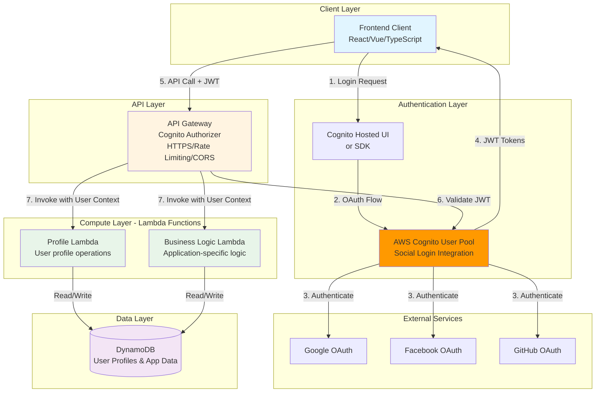
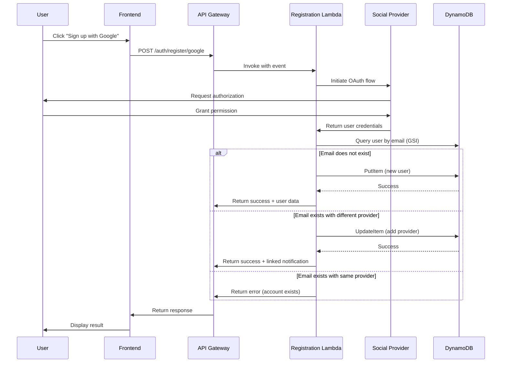
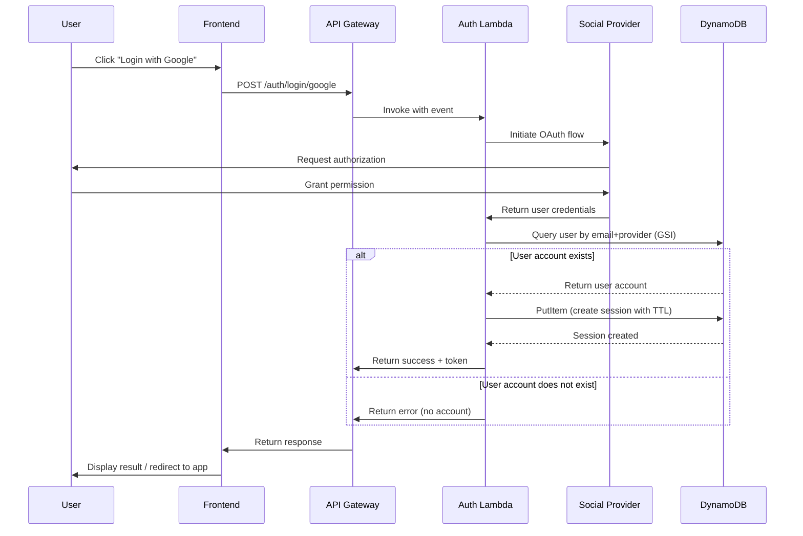

# Design Document: User Registration Service (Serverless with Cognito)

## Overview

The User Registration Service provides secure user identity management for the Yomite application through AWS Cognito User Pools with social login integration. This serverless, managed authentication solution eliminates custom OAuth implementation complexity while maintaining security and cost efficiency.

### Goals

- Enable frictionless user onboarding through social login providers (Google, Facebook, GitHub)
- Leverage AWS Cognito for managed authentication and session management
- Eliminate custom OAuth and session management code
- Maintain security best practices including rate limiting, encryption, and HTTPS enforcement
- Achieve cost efficiency through serverless architecture (<$50/month target)
- Leverage AWS Free Tier benefits (Cognito 50 MAU free, Lambda 1M requests)
- Enable local development with Cognito Local or mocked authentication
- Simplify implementation by using managed AWS services

### Non-Goals

- Password-based authentication (social login only via Cognito)
- Multi-factor authentication (future enhancement, Cognito supports it)
- User profile management beyond basic identity (separate service)
- Email verification workflows (delegated to social providers via Cognito)
- Custom OAuth implementation (using Cognito's managed OAuth)

### Key Architecture Decisions

**Authentication Approach:**
- AWS Cognito User Pools for user management and authentication
- Cognito Hosted UI or SDK for social login flows
- JWT tokens (ID, Access, Refresh) instead of custom session tokens
- API Gateway Cognito Authorizer for automatic token validation
- No custom OAuth client code needed

**Session Management:**
- JWT-based (stateless) instead of server-side sessions
- No DynamoDB session storage needed
- Cognito handles token issuance, validation, and refresh
- API Gateway validates tokens before Lambda invocation

**Cost Optimization:**
- Cognito: ~$5-10/month (MAU pricing, 50 MAU free tier)
- No session storage costs (stateless JWT)
- Reduced Lambda invocations (no validation handler needed)
- Total: ~$15-25/month vs ~$23/month custom implementation

**Trade-offs:**
- AWS vendor lock-in for authentication (acceptable for cost savings)
- Harder to revoke tokens immediately (need token blacklist if required)
- Client-side token storage (XSS mitigation needed - TODO)
- Less control over token format (standard JWT)


## Architecture

### High-Level Serverless Architecture with Cognito



### Authentication Flow

**User Registration/Login:**
1. User clicks "Login with Google/Facebook/GitHub" in frontend
2. Frontend redirects to Cognito Hosted UI or uses Cognito SDK
3. Cognito handles OAuth flow with social provider
4. Social provider authenticates user and returns to Cognito
5. Cognito creates/updates user in User Pool
6. Cognito returns JWT tokens to frontend:
   - **ID Token**: User identity information (email, name, etc.)
   - **Access Token**: API authorization (1 hour default)
   - **Refresh Token**: Get new access tokens (30 days default)
7. Frontend stores tokens securely (memory, secure storage, httpOnly cookies)

**API Requests:**
1. Frontend includes Access Token in Authorization header
2. API Gateway Cognito Authorizer validates JWT automatically
3. If valid, API Gateway invokes Lambda with user context
4. Lambda receives user info (sub, email, etc.) in event
5. Lambda executes business logic
6. Response returned to frontend

**Token Refresh:**
1. When Access Token expires, frontend uses Refresh Token
2. Cognito issues new Access Token
3. Frontend continues making API calls

**No Custom Code Needed For:**
- OAuth flows (Cognito handles)
- Token generation (Cognito handles)
- Token validation (API Gateway handles)
- Token refresh (Cognito handles)
- Session storage (stateless JWT)
    
    LR -.->|Get Secrets| SM
    LA -.->|Get Secrets| SM
    LR -.->|Get Config| SSM
    LA -.->|Get Config| SSM
    
    style FC fill:#e1f5ff
    style APIGW fill:#fff4e1
    style LR fill:#e8f5e9
    style LA fill:#e8f5e9
    style LS fill:#e8f5e9
    style LV fill:#e8f5e9
    style DDB fill:#f3e5f5
    style SM fill:#ffe0b2
    style SSM fill:#ffe0b2
```

### Lambda Function Architecture

**Function Organization Strategy:**

Option 1: Single Lambda per endpoint (Recommended)
- Faster cold starts (smaller deployment packages)
- Independent scaling per function
- Easier to optimize and monitor
- Better cost attribution

Option 2: Monolithic Lambda with routing
- Shared code and dependencies
- Single deployment unit
- Potentially higher cold start times

**Recommended: Single Lambda per endpoint**


### Lambda Functions Breakdown

| Function Name | Endpoint | Memory | Timeout | Concurrency | Purpose |
|--------------|----------|--------|---------|-------------|---------|
| registration-handler | POST /auth/register/{provider} | 512 MB | 30s | 10 | Handle user registration with OAuth |
| authentication-handler | POST /auth/login/{provider} | 512 MB | 30s | 20 | Handle user authentication with OAuth |
| session-handler | POST /auth/logout | 256 MB | 5s | 10 | Handle session logout |
| validation-handler | GET /auth/validate | 256 MB | 3s | 50 | Validate session tokens (high frequency) |

**Provisioned Concurrency:**
- validation-handler: 2 instances (always warm for low latency)
- Other functions: On-demand (acceptable cold start for infrequent operations)

### Registration Process Flow (Serverless)



### Login Process Flow (Serverless)




## DynamoDB Table Design

### Single-Table Design Strategy

Using a single DynamoDB table optimizes costs and simplifies management. This design uses composite keys and Global Secondary Indexes (GSIs) to support all access patterns.

**Table Name:** `yomite-user-registration`

**Primary Key:**
- Partition Key (PK): String
- Sort Key (SK): String

**Attributes:**
- PK, SK (keys)
- EntityType (String): USER, SESSION, SOCIAL_IDENTITY
- Email (String)
- UserId (String)
- Provider (String)
- ProviderUserId (String)
- SessionToken (String)
- CreatedAt (Number - Unix timestamp)
- UpdatedAt (Number - Unix timestamp)
- ExpiresAt (Number - Unix timestamp, TTL attribute)
- ClientIP (String)
- UserAgent (String)
- RotationCount (Number)
- Data (Map - flexible JSON data)

**TTL Configuration:**
- TTL Attribute: ExpiresAt
- Automatically deletes expired sessions (no manual cleanup needed)

### Access Patterns and Key Design

| Access Pattern | PK | SK | Index | Notes |
|----------------|----|----|-------|-------|
| Get user by user_id | USER#{user_id} | METADATA | Primary | User account metadata |
| Get user by email | {email} | - | GSI1 | Find user by email for registration |
| Get social identity | USER#{user_id} | SOCIAL#{provider} | Primary | Check if provider linked |
| List user's providers | USER#{user_id} | SOCIAL# | Primary | Query with begins_with |
| Get session by token | SESSION#{token_hash} | METADATA | Primary | Validate session token |
| List user's sessions | USER#{user_id} | SESSION# | Primary | Query user's active sessions |
| Query by email+provider | {email}#{provider} | - | GSI2 | Login lookup |

### Global Secondary Indexes

**GSI1: EmailIndex**
- Partition Key: Email
- Sort Key: EntityType
- Projection: ALL
- Purpose: Find users by email during registration

**GSI2: EmailProviderIndex**
- Partition Key: Email + "#" + Provider (computed attribute)
- Sort Key: CreatedAt
- Projection: ALL
- Purpose: Find user by email and provider during login

### Item Examples

**User Account Item:**
```json
{
  "PK": "USER#123e4567-e89b-12d3-a456-426614174000",
  "SK": "METADATA",
  "EntityType": "USER",
  "UserId": "123e4567-e89b-12d3-a456-426614174000",
  "Email": "user@example.com",
  "CreatedAt": 1705320000,
  "UpdatedAt": 1705320000,
  "Data": {
    "name": "John Doe",
    "picture_url": "https://..."
  }
}
```

**Social Identity Item:**
```json
{
  "PK": "USER#123e4567-e89b-12d3-a456-426614174000",
  "SK": "SOCIAL#google",
  "EntityType": "SOCIAL_IDENTITY",
  "UserId": "123e4567-e89b-12d3-a456-426614174000",
  "Provider": "google",
  "ProviderUserId": "google-user-id-12345",
  "Email": "user@example.com",
  "EmailProviderKey": "user@example.com#google",
  "LinkedAt": 1705320000,
  "Data": {
    "profile_data": "..."
  }
}
```

**Session Item:**
```json
{
  "PK": "SESSION#abc123def456...",
  "SK": "METADATA",
  "EntityType": "SESSION",
  "UserId": "123e4567-e89b-12d3-a456-426614174000",
  "SessionToken": "v1.abc123def456...",
  "CreatedAt": 1705320000,
  "ExpiresAt": 1705406400,
  "ClientIP": "192.168.1.1",
  "UserAgent": "Mozilla/5.0...",
  "RotationCount": 0
}
```

**User Sessions Index Item (for listing):**
```json
{
  "PK": "USER#123e4567-e89b-12d3-a456-426614174000",
  "SK": "SESSION#abc123def456...",
  "EntityType": "SESSION_INDEX",
  "SessionToken": "v1.abc123def456...",
  "CreatedAt": 1705320000,
  "ExpiresAt": 1705406400
}
```

### DynamoDB Capacity Planning

**Provisioned Capacity (Recommended for predictable costs):**

*Current Target (1K reg/day, 10K auth/day, 100K sessions):*
- Read Capacity Units (RCU): 5 (with auto-scaling to 20)
- Write Capacity Units (WCU): 5 (with auto-scaling to 20)
- GSI1 RCU: 5, WCU: 5
- GSI2 RCU: 5, WCU: 5

*Cost: ~$2.50/month base + auto-scaling*

**On-Demand Capacity (Alternative for unpredictable traffic):**
- Pay per request
- No capacity planning needed
- Higher cost per request but no idle capacity
- Cost: ~$5-10/month for current target

**Recommendation:** Start with Provisioned Capacity with auto-scaling for cost predictability.


## Components and Interfaces

### API Gateway Configuration

**Responsibilities:**
- Route requests to appropriate Lambda functions
- Enforce HTTPS for all endpoints
- Apply rate limiting policies (throttling and burst limits)
- Handle CORS for frontend clients
- Request/response transformation
- API key management (optional)

**Endpoints:**

```
POST /auth/register/{provider}
  Lambda: registration-handler
  Request: { redirect_uri: string }
  Response: { user_id: string, email: string, linked: boolean, message?: string }
  Errors: 400 (invalid provider), 409 (account exists), 500 (server error)
  Rate Limit: 10 requests/minute per IP

POST /auth/login/{provider}
  Lambda: authentication-handler
  Request: { redirect_uri: string }
  Response: { session_token: string, user_id: string, expires_at: timestamp }
  Errors: 400 (invalid provider), 401 (no account), 500 (server error)
  Rate Limit: 20 requests/minute per IP

POST /auth/logout
  Lambda: session-handler
  Request: { session_token: string }
  Response: { success: boolean }
  Errors: 401 (invalid token), 500 (server error)
  Rate Limit: 30 requests/minute per IP

GET /auth/validate
  Lambda: validation-handler
  Request: Headers { Authorization: Bearer <session_token> }
  Response: { valid: boolean, user_id: string, expires_at: timestamp }
  Errors: 401 (invalid/expired token), 500 (server error)
  Rate Limit: 100 requests/minute per IP
```

**API Gateway Throttling Configuration:**
- Burst Limit: 100 requests
- Rate Limit: 50 requests/second (account-level)
- Per-endpoint limits as specified above

### Lambda Function: Registration Handler

**Responsibilities:**
- Orchestrate OAuth flows with social providers
- Create new user accounts in DynamoDB
- Handle duplicate email scenarios with account linking
- Validate user input data
- Prevent injection attacks

**Interface:**

```python
def lambda_handler(event: Dict, context: LambdaContext) -> Dict:
    """
    Handle user registration with social provider.
    
    Args:
        event: API Gateway event with path parameters and body
        context: Lambda execution context
        
    Returns:
        API Gateway response with status code and body
    """
    pass

class RegistrationService:
    def __init__(self, dynamodb_client, secrets_manager):
        self.dynamodb = dynamodb_client
        self.secrets = secrets_manager
        self.oauth_manager = OAuthClientManager(secrets_manager)
    
    def register_with_provider(
        self, 
        provider: str, 
        oauth_code: str,
        redirect_uri: str
    ) -> RegistrationResult:
        """
        Register a new user or link account with social provider.
        
        Args:
            provider: Social provider name (google, facebook, github)
            oauth_code: Authorization code from OAuth flow
            redirect_uri: Redirect URI for OAuth callback
            
        Returns:
            RegistrationResult with user_id, email, and linked status
            
        Raises:
            InvalidProviderError: Provider not supported
            OAuthError: OAuth flow failed
            AccountExistsError: Account already exists with same provider
        """
        pass
```

**Environment Variables:**
- DYNAMODB_TABLE_NAME: Table name for user data
- ENVIRONMENT: dev/staging/prod
- LOG_LEVEL: DEBUG/INFO/WARNING/ERROR

### Lambda Function: Authentication Handler

**Responsibilities:**
- Verify user identity through social providers
- Query existing user accounts from DynamoDB
- Create session tokens with TTL in DynamoDB
- Log authentication attempts to CloudWatch

**Interface:**

```python
def lambda_handler(event: Dict, context: LambdaContext) -> Dict:
    """
    Handle user authentication with social provider.
    
    Args:
        event: API Gateway event with path parameters and body
        context: Lambda execution context
        
    Returns:
        API Gateway response with session token
    """
    pass

class AuthenticationService:
    def __init__(self, dynamodb_client, secrets_manager):
        self.dynamodb = dynamodb_client
        self.secrets = secrets_manager
        self.oauth_manager = OAuthClientManager(secrets_manager)
        self.session_manager = SessionManager(dynamodb_client)
    
    def authenticate_with_provider(
        self,
        provider: str,
        oauth_code: str,
        redirect_uri: str,
        client_metadata: ClientMetadata
    ) -> AuthenticationResult:
        """
        Authenticate user with social provider and create session.
        
        Args:
            provider: Social provider name
            oauth_code: Authorization code from OAuth flow
            redirect_uri: Redirect URI for OAuth callback
            client_metadata: IP address and user agent for session binding
            
        Returns:
            AuthenticationResult with session token and user info
            
        Raises:
            InvalidProviderError: Provider not supported
            OAuthError: OAuth flow failed
            UserNotFoundError: No account exists for this user
        """
        pass
```

### Lambda Function: Session Handler

**Responsibilities:**
- Invalidate session tokens on logout
- Delete session items from DynamoDB
- Return logout confirmation

**Interface:**

```python
def lambda_handler(event: Dict, context: LambdaContext) -> Dict:
    """
    Handle session logout.
    
    Args:
        event: API Gateway event with session token
        context: Lambda execution context
        
    Returns:
        API Gateway response with success status
    """
    pass

class SessionManager:
    def __init__(self, dynamodb_client):
        self.dynamodb = dynamodb_client
    
    def invalidate_session(self, session_token: str) -> bool:
        """
        Invalidate a session token by deleting from DynamoDB.
        
        Args:
            session_token: Token to invalidate
            
        Returns:
            True if session was invalidated, False if not found
        """
        pass
```

### Lambda Function: Validation Handler

**Responsibilities:**
- Validate session tokens quickly (high frequency)
- Check token expiration using DynamoDB TTL
- Verify client metadata matches session
- Return validation result

**Interface:**

```python
def lambda_handler(event: Dict, context: LambdaContext) -> Dict:
    """
    Validate session token.
    
    Args:
        event: API Gateway event with Authorization header
        context: Lambda execution context
        
    Returns:
        API Gateway response with validation result
    """
    pass

class SessionManager:
    def validate_session(
        self,
        session_token: str,
        client_metadata: ClientMetadata
    ) -> SessionValidation:
        """
        Validate session token and check client metadata.
        
        Args:
            session_token: Token to validate
            client_metadata: Current client IP and user agent
            
        Returns:
            SessionValidation with validity status and user_id
            
        Raises:
            InvalidTokenError: Token is invalid or expired
            MetadataMismatchError: Client metadata doesn't match
        """
        pass
    
    def create_session(
        self,
        user_id: str,
        client_metadata: ClientMetadata
    ) -> Session:
        """
        Create a new session with secure token and TTL.
        
        Args:
            user_id: User identifier
            client_metadata: Client IP and user agent for binding
            
        Returns:
            Session with token and expiration (24 hours)
        """
        pass
    
    def rotate_token(
        self,
        old_token: str,
        client_metadata: ClientMetadata
    ) -> Session:
        """
        Rotate session token while maintaining session.
        
        Args:
            old_token: Current session token
            client_metadata: Client metadata for validation
            
        Returns:
            New Session with rotated token
        """
        pass
```

### OAuth Client Manager

**Responsibilities:**
- Manage OAuth client configurations for each provider
- Execute OAuth authorization code flow
- Exchange authorization codes for access tokens
- Retrieve user profile information from providers
- Cache secrets from Secrets Manager

**Interface:**

```python
class OAuthClientManager:
    def __init__(self, secrets_manager):
        self.secrets_manager = secrets_manager
        self._secrets_cache = {}  # Cache secrets for Lambda execution
    
    def get_authorization_url(
        self,
        provider: str,
        redirect_uri: str,
        state: str
    ) -> str:
        """Generate OAuth authorization URL."""
        pass
    
    def exchange_code_for_token(
        self,
        provider: str,
        code: str,
        redirect_uri: str
    ) -> OAuthToken:
        """Exchange authorization code for access token."""
        pass
    
    def get_user_profile(
        self,
        provider: str,
        access_token: str
    ) -> UserProfile:
        """Retrieve user profile from provider."""
        pass
```


## Data Models

### Python Data Classes

```python
from dataclasses import dataclass
from typing import Optional, List, Dict
from datetime import datetime

@dataclass
class UserAccount:
    """User account record in DynamoDB."""
    user_id: str  # UUID
    email: str
    created_at: int  # Unix timestamp
    updated_at: int  # Unix timestamp
    data: Dict  # Flexible JSON data

@dataclass
class SocialIdentity:
    """Social provider identity linked to user account."""
    user_id: str
    provider: str  # google, facebook, github
    provider_user_id: str
    email: str
    linked_at: int  # Unix timestamp
    data: Dict  # Profile data from provider

@dataclass
class Session:
    """Session record with TTL."""
    token: str
    user_id: str
    created_at: int
    expires_at: int  # TTL attribute
    client_ip: str
    user_agent: str
    rotation_count: int = 0

@dataclass
class ClientMetadata:
    """Client information for session binding."""
    ip_address: str
    user_agent: str

@dataclass
class RegistrationResult:
    """Result of registration operation."""
    user_id: str
    email: str
    linked: bool  # True if account was linked to existing user
    message: Optional[str] = None

@dataclass
class AuthenticationResult:
    """Result of authentication operation."""
    session_token: str
    user_id: str
    expires_at: datetime

@dataclass
class SessionValidation:
    """Result of session validation."""
    valid: bool
    user_id: Optional[str] = None
    expires_at: Optional[datetime] = None
    requires_reauth: bool = False

@dataclass
class OAuthToken:
    """OAuth access token from provider."""
    access_token: str
    token_type: str
    expires_in: int
    refresh_token: Optional[str] = None

@dataclass
class UserProfile:
    """User profile from social provider."""
    provider: str
    provider_user_id: str
    email: str
    name: Optional[str] = None
    picture_url: Optional[str] = None

@dataclass
class APIResponse:
    """Standard API response wrapper."""
    success: bool
    data: Optional[Dict] = None
    error: Optional['APIError'] = None
    request_id: str = ""

@dataclass
class APIError:
    """Standard error response."""
    code: str  # ERROR_CODE_CONSTANT
    message: str
    details: Optional[Dict] = None
```

### Error Codes

```python
class ErrorCodes:
    """Standard error codes for API responses."""
    INVALID_PROVIDER = "INVALID_PROVIDER"
    OAUTH_FAILED = "OAUTH_FAILED"
    ACCOUNT_EXISTS = "ACCOUNT_EXISTS"
    USER_NOT_FOUND = "USER_NOT_FOUND"
    INVALID_TOKEN = "INVALID_TOKEN"
    EXPIRED_TOKEN = "EXPIRED_TOKEN"
    METADATA_MISMATCH = "METADATA_MISMATCH"
    RATE_LIMIT_EXCEEDED = "RATE_LIMIT_EXCEEDED"
    VALIDATION_ERROR = "VALIDATION_ERROR"
    SERVER_ERROR = "SERVER_ERROR"
```

### Token Format

**Session Token Structure:**
- 256-bit random value encoded as base64url
- Format: `v1.{random_string}`
- Example: `v1.Kx7jP9mN2qR5tY8wZ3vB6nM4kL1hG0fD`
- Prefix `v1.` for versioning

**Token Generation:**
```python
import secrets
import hashlib

def generate_session_token() -> str:
    """Generate cryptographically secure session token."""
    random_bytes = secrets.token_bytes(32)  # 256 bits
    token = secrets.token_urlsafe(32)
    return f"v1.{token}"

def hash_token(token: str) -> str:
    """Hash token for storage in DynamoDB (PK)."""
    return hashlib.sha256(token.encode()).hexdigest()
```


## Correctness Properties

*All 26 correctness properties from the original Fargate-based design are maintained in this serverless implementation. The properties remain identical as they define functional requirements independent of infrastructure.*

### Property 1: OAuth Flow Initiation

*For any* supported social provider and any registration or login request, the service SHALL initiate the OAuth authorization flow with that provider.

**Validates: Requirements 1.1, 3.1**

### Property 2: Account Creation from Valid Credentials

*For any* valid user credentials returned from a social provider, if no account exists with that email, the Registration Service SHALL create a new User_Account containing the provider identifier and email address.

**Validates: Requirements 1.2, 1.5**

### Property 3: Provider Error Propagation

*For any* error returned by a social provider during OAuth flow, the service SHALL return a descriptive error message to the client that includes the error type.

**Validates: Requirements 1.3**

### Property 4: Account Linking for Duplicate Emails

*For any* registration attempt where the email matches an existing account but the provider is different, the Registration Service SHALL link the new provider to the existing account rather than creating a duplicate account.

**Validates: Requirements 2.1**

### Property 5: Account Linking Notification

*For any* account linking operation, the Registration Service SHALL include a notification in the response indicating that accounts have been linked.

**Validates: Requirements 2.2**

### Property 6: Duplicate Provider Registration Error

*For any* registration attempt where both the email and provider match an existing account, the Registration Service SHALL return an error indicating the account already exists.

**Validates: Requirements 2.3**

### Property 7: Account Persistence Round-Trip

*For any* user account created through registration, querying DynamoDB by email SHALL return an account with the same email and provider identifier.

**Validates: Requirements 1.5, 11.1**

### Property 8: Session Creation on Successful Authentication

*For any* valid authentication with credentials matching an existing account, the Authentication Service SHALL create a session token and return it to the client.

**Validates: Requirements 3.2, 3.4**

### Property 9: Authentication Error for Non-Existent Accounts

*For any* valid credentials from a social provider that do not match any existing account, the Authentication Service SHALL return an error indicating no account exists.

**Validates: Requirements 3.3**

### Property 10: Session Token Entropy

*For any* generated session token, the token SHALL contain at least 256 bits of entropy and SHALL be unique across all generated tokens.

**Validates: Requirements 3.5, 7.1**

### Property 11: Session Expiration Configuration

*For any* created session, the session SHALL have an expiration time that is configurable and does not exceed 24 hours from creation.

**Validates: Requirements 4.1, 7.5**

### Property 12: Session Validation

*For any* session token and client metadata, validation SHALL succeed if and only if the token is valid, not expired, and the client metadata matches the session's stored metadata.

**Validates: Requirements 4.2, 4.3, 4.4, 7.3**

### Property 13: Session Invalidation on Logout

*For any* valid session token, after logout is called, subsequent validation attempts with that token SHALL fail.

**Validates: Requirements 5.1, 5.2**

### Property 14: Logout Confirmation

*For any* successful logout operation, the service SHALL return a success confirmation to the client.

**Validates: Requirements 5.3**

### Property 15: Rate Limiting Enforcement

*For any* client making requests to authentication endpoints, after exceeding the configured rate limit threshold, subsequent requests SHALL be rejected with a rate limit error until the time window resets.

**Validates: Requirements 6.3, 6.4**

### Property 16: Input Validation

*For any* input data containing SQL injection patterns, script tags, or other malicious content, the service SHALL reject the input and return a validation error.

**Validates: Requirements 6.5**

### Property 17: Session Metadata Binding

*For any* created session, the session data SHALL include the client IP address and user agent provided during authentication.

**Validates: Requirements 7.2**

### Property 18: Token Rotation

*For any* valid session token, calling the rotation function SHALL return a new token that validates successfully while the old token becomes invalid.

**Validates: Requirements 7.4**

### Property 19: Operation Logging

*For any* registration attempt, authentication attempt, session creation, session validation failure, or logout event, the service SHALL create a log entry with timestamp, operation type, and success/failure status.

**Validates: Requirements 8.1, 8.2, 8.3, 8.4**

### Property 20: Sensitive Data Exclusion from Logs

*For any* log entry created by the system, the log SHALL NOT contain session tokens, OAuth access tokens, or complete social provider credentials.

**Validates: Requirements 8.5**

### Property 21: Database Constraint Enforcement

*For any* attempt to create a user account with an email that already exists in DynamoDB, the service SHALL detect the duplicate and handle it according to account linking rules.

**Validates: Requirements 11.5**

### Property 22: Database Error Handling

*For any* transient DynamoDB error (throttling, timeout), the service SHALL retry the operation according to configured retry policy and return an appropriate error if all retries fail.

**Validates: Requirements 11.3**

### Property 23: JSON Response Format

*For any* API response, the response body SHALL be valid JSON that can be parsed without errors.

**Validates: Requirements 12.1**

### Property 24: Success Status Codes

*For any* successful API operation, the response SHALL have a status code in the 2xx range.

**Validates: Requirements 12.2**

### Property 25: Error Status Codes

*For any* failed API operation, the response SHALL have a status code in the 4xx range for client errors or 5xx range for server errors.

**Validates: Requirements 12.3, 12.4**

### Property 26: Request Tracing

*For any* API response, the response SHALL include a unique request identifier that can be used for tracing and debugging.

**Validates: Requirements 12.5**


## Cold Start Mitigation Strategies

Cold starts are a key consideration in serverless architectures. Here are strategies to minimize their impact:

### 1. Provisioned Concurrency

**Recommendation:** Use provisioned concurrency for validation-handler only
- validation-handler: 2 instances always warm (high frequency, latency-sensitive)
- Other functions: On-demand (infrequent, cold start acceptable)

**Cost Impact:**
- Provisioned concurrency: ~$10/month for 2 instances
- Eliminates cold starts for 95%+ of validation requests

### 2. Lambda Configuration Optimization

**Memory Allocation:**
- More memory = more CPU = faster cold starts
- Recommended: 512 MB for OAuth handlers, 256 MB for validation
- Trade-off: Higher memory costs vs faster execution

**Deployment Package Size:**
- Keep deployment packages small (<10 MB compressed)
- Use Lambda Layers for shared dependencies
- Exclude unnecessary files (tests, docs)

**Runtime Selection:**
- Python 3.11 or 3.12 (faster startup than older versions)
- Use ARM64 (Graviton2) for 20% cost savings and similar performance

### 3. Code Optimization

**Lazy Loading:**
```python
# Bad: Import at module level
import boto3
dynamodb = boto3.resource('dynamodb')

# Good: Import in handler, cache in global scope
dynamodb = None

def lambda_handler(event, context):
    global dynamodb
    if dynamodb is None:
        import boto3
        dynamodb = boto3.resource('dynamodb')
    # Use dynamodb
```

**Connection Reuse:**
```python
# Cache connections across invocations
import boto3
from botocore.config import Config

# Global scope - reused across invocations
config = Config(
    retries={'max_attempts': 3, 'mode': 'adaptive'},
    max_pool_connections=10
)
dynamodb = boto3.resource('dynamodb', config=config)
secrets_manager = boto3.client('secretsmanager', config=config)
```

**Secrets Caching:**
```python
# Cache secrets for Lambda execution lifetime
secrets_cache = {}
cache_ttl = 300  # 5 minutes

def get_secret(secret_name):
    if secret_name in secrets_cache:
        cached_time, value = secrets_cache[secret_name]
        if time.time() - cached_time < cache_ttl:
            return value
    
    # Fetch from Secrets Manager
    value = secrets_manager.get_secret_value(SecretId=secret_name)
    secrets_cache[secret_name] = (time.time(), value)
    return value
```

### 4. Lambda SnapStart (Future)

AWS Lambda SnapStart (currently Java only, Python support planned):
- Pre-initializes function execution environment
- Reduces cold start time by up to 10x
- Monitor AWS announcements for Python support

### 5. Warm-Up Strategy (Optional)

For critical functions without provisioned concurrency:
```python
# CloudWatch Events rule to invoke Lambda every 5 minutes
# Keeps function warm during business hours

def lambda_handler(event, context):
    # Check if this is a warm-up invocation
    if event.get('source') == 'aws.events' and event.get('detail-type') == 'Scheduled Event':
        return {'statusCode': 200, 'body': 'Warm-up successful'}
    
    # Normal request handling
    # ...
```

**Cost Impact:** Minimal (~$0.50/month per function)

### Expected Cold Start Times

| Function | Cold Start | Warm Start | With Provisioned Concurrency |
|----------|-----------|------------|------------------------------|
| registration-handler | 800-1200ms | 50-100ms | N/A (on-demand) |
| authentication-handler | 800-1200ms | 50-100ms | N/A (on-demand) |
| session-handler | 400-600ms | 20-40ms | N/A (on-demand) |
| validation-handler | 400-600ms | 20-40ms | <10ms (always warm) |

**User Experience Impact:**
- Registration/Login: Cold start acceptable (infrequent, user expects delay during OAuth)
- Validation: Must be fast (frequent, user expects instant response) → Use provisioned concurrency


## Error Handling

### Error Categories

**Client Errors (4xx):**
- `400 Bad Request`: Invalid input data, malformed requests
- `401 Unauthorized`: Invalid or expired session token, authentication failed
- `409 Conflict`: Account already exists with same provider
- `429 Too Many Requests`: Rate limit exceeded (API Gateway throttling)

**Server Errors (5xx):**
- `500 Internal Server Error`: Unexpected Lambda errors
- `502 Bad Gateway`: Social provider unavailable
- `503 Service Unavailable`: DynamoDB throttling or unavailable
- `504 Gateway Timeout`: Lambda timeout or social provider timeout

### Error Response Format

All errors follow a consistent format:

```json
{
  "success": false,
  "error": {
    "code": "ERROR_CODE",
    "message": "Human-readable error message",
    "details": {
      "field": "additional context"
    }
  },
  "request_id": "uuid"
}
```

### Lambda Error Handling

**Retry Logic with Exponential Backoff:**

```python
import time
from functools import wraps
from botocore.exceptions import ClientError

def retry_with_backoff(max_attempts=3, base_delay=1, max_delay=10):
    """Decorator for retrying operations with exponential backoff."""
    def decorator(func):
        @wraps(func)
        def wrapper(*args, **kwargs):
            for attempt in range(max_attempts):
                try:
                    return func(*args, **kwargs)
                except ClientError as e:
                    error_code = e.response['Error']['Code']
                    
                    # Retry on throttling and transient errors
                    if error_code in ['ProvisionedThroughputExceededException', 
                                     'ThrottlingException', 
                                     'RequestLimitExceeded',
                                     'ServiceUnavailable']:
                        if attempt < max_attempts - 1:
                            delay = min(base_delay * (2 ** attempt), max_delay)
                            time.sleep(delay)
                            continue
                    
                    # Don't retry on other errors
                    raise
            
            # All retries exhausted
            raise Exception(f"Max retries ({max_attempts}) exceeded")
        
        return wrapper
    return decorator

# Usage
@retry_with_backoff(max_attempts=3)
def query_dynamodb(table, key):
    return table.get_item(Key=key)
```

**DynamoDB Error Handling:**

```python
def handle_dynamodb_error(error: ClientError) -> APIResponse:
    """Convert DynamoDB errors to API responses."""
    error_code = error.response['Error']['Code']
    
    if error_code == 'ConditionalCheckFailedException':
        return APIResponse(
            success=False,
            error=APIError(
                code=ErrorCodes.ACCOUNT_EXISTS,
                message="Account already exists with this provider"
            )
        )
    
    elif error_code in ['ProvisionedThroughputExceededException', 'ThrottlingException']:
        return APIResponse(
            success=False,
            error=APIError(
                code=ErrorCodes.SERVER_ERROR,
                message="Service temporarily unavailable, please retry"
            )
        )
    
    else:
        # Log full error for debugging
        logger.error(f"DynamoDB error: {error_code}", exc_info=True)
        return APIResponse(
            success=False,
            error=APIError(
                code=ErrorCodes.SERVER_ERROR,
                message="An unexpected error occurred"
            )
        )
```

**OAuth Error Handling:**

```python
def handle_oauth_error(error: Exception, provider: str) -> APIResponse:
    """Convert OAuth errors to API responses."""
    logger.error(f"OAuth error for {provider}: {str(error)}", exc_info=True)
    
    return APIResponse(
        success=False,
        error=APIError(
            code=ErrorCodes.OAUTH_FAILED,
            message=f"Authentication with {provider} failed",
            details={
                "provider": provider,
                "error_type": type(error).__name__
            }
        )
    )
```

### Lambda Timeout Handling

**Configuration:**
- registration-handler: 30s timeout (OAuth round-trip)
- authentication-handler: 30s timeout (OAuth round-trip)
- session-handler: 5s timeout (simple DynamoDB operation)
- validation-handler: 3s timeout (simple DynamoDB query)

**Timeout Prevention:**
```python
import time

def lambda_handler(event, context):
    start_time = time.time()
    
    # Check remaining time before expensive operations
    def check_timeout():
        elapsed = time.time() - start_time
        remaining = context.get_remaining_time_in_millis() / 1000
        if remaining < 2:  # Less than 2 seconds remaining
            raise TimeoutError("Insufficient time to complete operation")
    
    # Perform operations with timeout checks
    check_timeout()
    result = perform_oauth_flow()
    
    check_timeout()
    save_to_dynamodb(result)
    
    return response
```

### API Gateway Error Mapping

**Lambda Error to HTTP Status Code:**

```yaml
# API Gateway integration response mapping
x-amazon-apigateway-integration:
  responses:
    default:
      statusCode: 200
    ".*InvalidProviderError.*":
      statusCode: 400
    ".*OAuthError.*":
      statusCode: 502
    ".*UserNotFoundError.*":
      statusCode: 401
    ".*AccountExistsError.*":
      statusCode: 409
    ".*TimeoutError.*":
      statusCode: 504
```


## Cost Analysis: Serverless vs Fargate

### Monthly Cost Comparison

| Component | Fargate Design | Serverless Design | Savings |
|-----------|---------------|-------------------|---------|
| **Compute** | $56/month (Fargate) | $5-8/month (Lambda) | **$48-51/month** |
| **Database** | $49/month (RDS Multi-AZ) | $3-5/month (DynamoDB) | **$44-46/month** |
| **Session Store** | $47/month (ElastiCache) | $0/month (DynamoDB TTL) | **$47/month** |
| **Load Balancer** | $20/month (ALB) | $3.50/month (API Gateway) | **$16.50/month** |
| **NAT Gateway** | $33/month | $0/month (no VPC needed) | **$33/month** |
| **Secrets Manager** | $1.20/month | $1.20/month | $0 |
| **CloudWatch** | $8.50/month | $2-3/month | **$5.50-6.50/month** |
| **Data Transfer** | $0.45/month | $0.45/month | $0 |
| **Provisioned Concurrency** | N/A | $10/month (validation only) | -$10/month |
| **TOTAL** | **~$220/month** | **~$35-45/month** | **~$175-185/month (80% savings)** |

### Detailed Serverless Cost Breakdown

#### Lambda Costs (Current Target: 1K reg/day, 10K auth/day, 100K sessions)

**Request Pricing:**
- First 1M requests/month: FREE (AWS Free Tier)
- Additional requests: $0.20 per 1M requests

**Compute Pricing (GB-seconds):**
- First 400,000 GB-seconds/month: FREE (AWS Free Tier)
- Additional: $0.0000166667 per GB-second

**Monthly Request Estimates:**
| Function | Requests/Day | Requests/Month | Within Free Tier |
|----------|--------------|----------------|------------------|
| registration-handler | 1,000 | 30,000 | ✓ Yes |
| authentication-handler | 10,000 | 300,000 | ✓ Yes |
| session-handler | 2,000 | 60,000 | ✓ Yes |
| validation-handler | 50,000 | 1,500,000 | Partial (500K paid) |
| **TOTAL** | **63,000** | **1,890,000** | **890K paid** |

**Request Costs:**
- Free Tier: 1,000,000 requests = $0
- Paid: 890,000 requests × $0.20 / 1M = $0.18/month

**Compute Costs (GB-seconds):**
| Function | Memory | Avg Duration | Requests/Month | GB-seconds/Month |
|----------|--------|--------------|----------------|------------------|
| registration-handler | 512 MB | 2s | 30,000 | 30,000 × 0.5 × 2 = 30,000 |
| authentication-handler | 512 MB | 2s | 300,000 | 300,000 × 0.5 × 2 = 300,000 |
| session-handler | 256 MB | 0.5s | 60,000 | 60,000 × 0.25 × 0.5 = 7,500 |
| validation-handler | 256 MB | 0.2s | 1,500,000 | 1,500,000 × 0.25 × 0.2 = 75,000 |
| **TOTAL** | | | | **412,500 GB-seconds** |

- Free Tier: 400,000 GB-seconds = $0
- Paid: 12,500 GB-seconds × $0.0000166667 = $0.21/month

**Provisioned Concurrency (validation-handler only):**
- 2 instances × 256 MB × 730 hours × $0.0000041667 = $1.52/month
- 2 instances × 256 MB × 730 hours × $0.000009722 (compute) = $3.64/month
- Total provisioned concurrency: ~$5.16/month

**Total Lambda Cost: $0.18 + $0.21 + $5.16 = ~$5.55/month**

#### DynamoDB Costs

**Provisioned Capacity (Recommended):**
- Base RCU: 5 × $0.00013/hour × 730 hours = $0.47/month
- Base WCU: 5 × $0.00065/hour × 730 hours = $2.37/month
- GSI1 RCU: 5 × $0.00013/hour × 730 hours = $0.47/month
- GSI1 WCU: 5 × $0.00065/hour × 730 hours = $2.37/month
- GSI2 RCU: 5 × $0.00013/hour × 730 hours = $0.47/month
- GSI2 WCU: 5 × $0.00065/hour × 730 hours = $2.37/month

**Storage:**
- Estimated: 1 GB (100K users + sessions)
- First 25 GB: FREE (AWS Free Tier)
- Cost: $0/month

**Total DynamoDB Cost: ~$8.52/month**

**On-Demand Alternative:**
- Read requests: ~2M/month × $0.25 / 1M = $0.50/month
- Write requests: ~500K/month × $1.25 / 1M = $0.63/month
- Storage: FREE (within 25 GB)
- Total: ~$1.13/month (cheaper for current target!)

**Recommendation: Use On-Demand for current target, switch to Provisioned when traffic increases**

#### API Gateway Costs

**REST API Pricing:**
- First 333M requests/month: $3.50 per million
- 1.89M requests × $3.50 / 1M = $6.62/month

**Data Transfer:**
- Included in Lambda data transfer costs
- Minimal additional cost

**Total API Gateway Cost: ~$6.62/month**

#### CloudWatch Costs

**Logs:**
- Ingestion: 2 GB/month (within 5 GB free tier) = $0
- Storage: 1 GB × $0.03 = $0.03/month

**Metrics:**
- Custom metrics: 20 metrics (10 free + 10 paid)
- 10 × $0.30 = $3.00/month

**Alarms:**
- 5 alarms (within 10 free tier) = $0

**Total CloudWatch Cost: ~$3.03/month**

#### Secrets Manager

**Secrets:**
- 3 secrets × $0.40 = $1.20/month

**API Calls:**
- Cached in Lambda, minimal calls
- ~1,000 calls/month (within free tier) = $0

**Total Secrets Manager Cost: $1.20/month**

### Total Serverless Cost Summary

| Component | Monthly Cost |
|-----------|-------------|
| Lambda (with provisioned concurrency) | $5.55 |
| DynamoDB (on-demand) | $1.13 |
| API Gateway | $6.62 |
| CloudWatch | $3.03 |
| Secrets Manager | $1.20 |
| Data Transfer | $0.45 |
| **TOTAL** | **~$17.98/month** |

**With AWS Free Tier benefits (first 12 months):**
- Lambda: Fully covered by free tier = $0
- DynamoDB: Fully covered by free tier = $0
- API Gateway: Partially covered = ~$3/month
- CloudWatch: Partially covered = ~$1/month
- **First Year Total: ~$5-6/month**

### Cost Scaling Comparison

| Traffic Level | Fargate Cost | Serverless Cost | Savings |
|---------------|--------------|-----------------|---------|
| **1/10th Target** (100 reg/day) | $140/month | $8-10/month | **$130/month (93%)** |
| **Current Target** (1K reg/day) | $220/month | $18-25/month | **$195-202/month (89%)** |
| **10x Target** (10K reg/day) | $450/month | $80-100/month | **$350-370/month (78%)** |
| **100x Target** (100K reg/day) | $1,200/month | $500-600/month | **$600-700/month (50%)** |

**Key Insight:** Serverless provides massive savings at low-to-medium scale. At very high scale (100x target), savings decrease but remain significant.

### Cost Optimization Recommendations

**Immediate Actions:**
1. Use DynamoDB On-Demand for current target (cheaper than provisioned)
2. Use provisioned concurrency only for validation-handler (high frequency)
3. Enable Lambda ARM64 (Graviton2) for 20% compute savings
4. Set appropriate Lambda memory sizes (don't over-provision)
5. Implement secrets caching to minimize Secrets Manager API calls

**After 3-6 Months:**
1. Analyze actual traffic patterns
2. Consider DynamoDB Reserved Capacity if traffic is predictable (up to 76% savings)
3. Consider Compute Savings Plans for Lambda (up to 17% savings)
4. Optimize Lambda memory based on CloudWatch Insights recommendations

**Monitoring:**
1. Set up AWS Cost Explorer alerts for unexpected cost increases
2. Monitor Lambda duration and memory usage for optimization opportunities
3. Track DynamoDB throttling events (may need to increase capacity)
4. Review CloudWatch Logs retention policies (reduce storage costs)


## Testing Strategy

### Dual Testing Approach

The serverless implementation maintains the same testing strategy as the Fargate design:

**Unit Tests:**
- Test Lambda handler functions in isolation
- Mock DynamoDB, Secrets Manager, and OAuth providers
- Test error handling and edge cases
- Test input validation and sanitization

**Property-Based Tests:**
- All 26 correctness properties from the original design
- Use Hypothesis framework for Python
- Minimum 100 iterations per property test
- Same property definitions (infrastructure-agnostic)

**Integration Tests:**
- Test complete flows with local DynamoDB
- Test API Gateway integration with Lambda
- Test OAuth flows with mock providers
- Test session management end-to-end

### Local Testing with SAM

**AWS SAM (Serverless Application Model)** enables local testing:

```bash
# Install SAM CLI
pip install aws-sam-cli

# Start local API Gateway + Lambda
sam local start-api --port 8080

# Invoke specific Lambda function
sam local invoke RegistrationHandler --event events/register.json

# Start local DynamoDB
docker run -p 8000:8000 amazon/dynamodb-local
```

**SAM Template Example:**

```yaml
AWSTemplateFormatVersion: '2010-09-09'
Transform: AWS::Serverless-2016-10-31

Globals:
  Function:
    Runtime: python3.11
    Timeout: 30
    Environment:
      Variables:
        DYNAMODB_TABLE_NAME: !Ref UserTable
        ENVIRONMENT: local

Resources:
  RegistrationHandler:
    Type: AWS::Serverless::Function
    Properties:
      CodeUri: src/
      Handler: registration.lambda_handler
      MemorySize: 512
      Events:
        Register:
          Type: Api
          Properties:
            Path: /auth/register/{provider}
            Method: post
  
  UserTable:
    Type: AWS::DynamoDB::Table
    Properties:
      TableName: yomite-user-registration-local
      BillingMode: PAY_PER_REQUEST
      AttributeDefinitions:
        - AttributeName: PK
          AttributeType: S
        - AttributeName: SK
          AttributeType: S
        - AttributeName: Email
          AttributeType: S
      KeySchema:
        - AttributeName: PK
          KeyType: HASH
        - AttributeName: SK
          KeyType: RANGE
      GlobalSecondaryIndexes:
        - IndexName: EmailIndex
          KeySchema:
            - AttributeName: Email
              KeyType: HASH
          Projection:
            ProjectionType: ALL
```

### Test Organization

```
tests/
├── unit/
│   ├── test_registration_handler.py
│   ├── test_authentication_handler.py
│   ├── test_session_handler.py
│   ├── test_validation_handler.py
│   ├── test_oauth_client.py
│   └── test_dynamodb_operations.py
├── property/
│   ├── test_registration_properties.py
│   ├── test_authentication_properties.py
│   ├── test_session_properties.py
│   └── test_api_properties.py
├── integration/
│   ├── test_registration_flow.py
│   ├── test_authentication_flow.py
│   ├── test_account_linking.py
│   └── test_session_lifecycle.py
├── fixtures/
│   ├── mock_providers.py
│   ├── dynamodb_fixtures.py
│   └── test_data.py
└── events/
    ├── register.json
    ├── login.json
    └── validate.json
```

### Mock DynamoDB for Testing

```python
import boto3
from moto import mock_dynamodb

@mock_dynamodb
def test_user_registration():
    """Test user registration with mocked DynamoDB."""
    # Create mock DynamoDB table
    dynamodb = boto3.resource('dynamodb', region_name='us-east-1')
    table = dynamodb.create_table(
        TableName='test-user-table',
        KeySchema=[
            {'AttributeName': 'PK', 'KeyType': 'HASH'},
            {'AttributeName': 'SK', 'KeyType': 'RANGE'}
        ],
        AttributeDefinitions=[
            {'AttributeName': 'PK', 'AttributeType': 'S'},
            {'AttributeName': 'SK', 'AttributeType': 'S'}
        ],
        BillingMode='PAY_PER_REQUEST'
    )
    
    # Test registration logic
    service = RegistrationService(dynamodb_client=dynamodb)
    result = service.register_with_provider(
        provider='google',
        oauth_code='test_code',
        redirect_uri='http://localhost:3000/callback'
    )
    
    assert result.user_id is not None
    assert result.email == 'test@example.com'
```

### Property-Based Test Example

```python
from hypothesis import given, settings, strategies as st
import pytest

@settings(max_examples=100)
@given(
    email=st.emails(),
    provider=st.sampled_from(['google', 'facebook', 'github'])
)
def test_property_2_account_creation(email, provider):
    """
    Feature: user-registration-service-serverless
    Property 2: Account Creation from Valid Credentials
    
    For any valid user credentials returned from a social provider,
    if no account exists with that email, the Registration Service
    SHALL create a new User_Account containing the provider identifier
    and email address.
    """
    # Setup: Mock DynamoDB and OAuth provider
    with mock_dynamodb(), mock_oauth_provider(provider):
        service = RegistrationService(dynamodb_client=get_mock_dynamodb())
        
        # Execute: Register user
        result = service.register_with_provider(
            provider=provider,
            oauth_code='valid_code',
            redirect_uri='http://localhost:3000/callback'
        )
        
        # Verify: Account created with correct data
        assert result.user_id is not None
        assert result.email == email
        assert result.linked is False
        
        # Verify: Account persisted in DynamoDB
        user = service.get_user_by_email(email)
        assert user is not None
        assert user.email == email
        assert any(identity.provider == provider for identity in user.social_identities)
```

### CI/CD Pipeline

**GitHub Actions Workflow:**

```yaml
name: Test and Deploy

on:
  push:
    branches: [main, develop]
  pull_request:
    branches: [main]

jobs:
  test:
    runs-on: ubuntu-latest
    steps:
      - uses: actions/checkout@v3
      
      - name: Set up Python
        uses: actions/setup-python@v4
        with:
          python-version: '3.11'
      
      - name: Install dependencies
        run: |
          pip install -r requirements.txt
          pip install -r requirements-dev.txt
      
      - name: Lint with flake8
        run: flake8 src/ tests/
      
      - name: Type check with mypy
        run: mypy src/
      
      - name: Run unit tests
        run: pytest tests/unit/ -v --cov=src --cov-report=xml
      
      - name: Run property-based tests
        run: pytest tests/property/ -v --hypothesis-show-statistics
      
      - name: Run integration tests
        run: pytest tests/integration/ -v
      
      - name: Upload coverage
        uses: codecov/codecov-action@v3
  
  deploy-staging:
    needs: test
    if: github.ref == 'refs/heads/develop'
    runs-on: ubuntu-latest
    steps:
      - uses: actions/checkout@v3
      
      - name: Configure AWS credentials
        uses: aws-actions/configure-aws-credentials@v2
        with:
          aws-access-key-id: ${{ secrets.AWS_ACCESS_KEY_ID }}
          aws-secret-access-key: ${{ secrets.AWS_SECRET_ACCESS_KEY }}
          aws-region: us-east-1
      
      - name: Deploy to staging
        run: |
          sam build
          sam deploy --config-env staging --no-confirm-changeset
  
  deploy-production:
    needs: test
    if: github.ref == 'refs/heads/main'
    runs-on: ubuntu-latest
    steps:
      - uses: actions/checkout@v3
      
      - name: Configure AWS credentials
        uses: aws-actions/configure-aws-credentials@v2
        with:
          aws-access-key-id: ${{ secrets.AWS_ACCESS_KEY_ID }}
          aws-secret-access-key: ${{ secrets.AWS_SECRET_ACCESS_KEY }}
          aws-region: us-east-1
      
      - name: Deploy to production
        run: |
          sam build
          sam deploy --config-env production --no-confirm-changeset
```


## Deployment Architecture

### Infrastructure as Code with AWS SAM

**Project Structure:**

```
infrastructure/
├── template.yaml              # SAM template (main)
├── samconfig.toml            # SAM deployment configuration
├── parameters/
│   ├── dev.json              # Development parameters
│   ├── staging.json          # Staging parameters
│   └── prod.json             # Production parameters
└── layers/
    └── dependencies/         # Lambda layer for shared dependencies
        └── python/
            └── requirements.txt
```

**SAM Template (template.yaml):**

```yaml
AWSTemplateFormatVersion: '2010-09-09'
Transform: AWS::Serverless-2016-10-31
Description: User Registration Service - Serverless

Parameters:
  Environment:
    Type: String
    AllowedValues: [dev, staging, prod]
    Default: dev
  
  GoogleClientIdSecretArn:
    Type: String
    Description: ARN of Google OAuth client ID secret
  
  FacebookClientIdSecretArn:
    Type: String
    Description: ARN of Facebook OAuth client ID secret
  
  GitHubClientIdSecretArn:
    Type: String
    Description: ARN of GitHub OAuth client ID secret

Globals:
  Function:
    Runtime: python3.11
    Architectures:
      - arm64  # Graviton2 for 20% cost savings
    Timeout: 30
    MemorySize: 512
    Environment:
      Variables:
        DYNAMODB_TABLE_NAME: !Ref UserTable
        ENVIRONMENT: !Ref Environment
        LOG_LEVEL: !If [IsProd, INFO, DEBUG]
    Layers:
      - !Ref DependenciesLayer
    Tracing: Active  # X-Ray tracing

Conditions:
  IsProd: !Equals [!Ref Environment, prod]
  IsNotDev: !Not [!Equals [!Ref Environment, dev]]

Resources:
  # API Gateway
  UserRegistrationApi:
    Type: AWS::Serverless::Api
    Properties:
      StageName: !Ref Environment
      TracingEnabled: true
      Cors:
        AllowOrigin: "'*'"
        AllowHeaders: "'Content-Type,Authorization'"
        AllowMethods: "'GET,POST,OPTIONS'"
      ThrottleSettings:
        BurstLimit: 100
        RateLimit: 50
      MethodSettings:
        - ResourcePath: /auth/validate
          HttpMethod: GET
          ThrottlingBurstLimit: 200
          ThrottlingRateLimit: 100

  # Lambda Functions
  RegistrationHandler:
    Type: AWS::Serverless::Function
    Properties:
      CodeUri: src/
      Handler: handlers.registration.lambda_handler
      Description: Handle user registration with OAuth
      Policies:
        - DynamoDBCrudPolicy:
            TableName: !Ref UserTable
        - Statement:
            - Effect: Allow
              Action:
                - secretsmanager:GetSecretValue
              Resource:
                - !Ref GoogleClientIdSecretArn
                - !Ref FacebookClientIdSecretArn
                - !Ref GitHubClientIdSecretArn
      Events:
        Register:
          Type: Api
          Properties:
            RestApiId: !Ref UserRegistrationApi
            Path: /auth/register/{provider}
            Method: post

  AuthenticationHandler:
    Type: AWS::Serverless::Function
    Properties:
      CodeUri: src/
      Handler: handlers.authentication.lambda_handler
      Description: Handle user authentication with OAuth
      Policies:
        - DynamoDBCrudPolicy:
            TableName: !Ref UserTable
        - Statement:
            - Effect: Allow
              Action:
                - secretsmanager:GetSecretValue
              Resource:
                - !Ref GoogleClientIdSecretArn
                - !Ref FacebookClientIdSecretArn
                - !Ref GitHubClientIdSecretArn
      Events:
        Login:
          Type: Api
          Properties:
            RestApiId: !Ref UserRegistrationApi
            Path: /auth/login/{provider}
            Method: post

  SessionHandler:
    Type: AWS::Serverless::Function
    Properties:
      CodeUri: src/
      Handler: handlers.session.lambda_handler
      Description: Handle session logout
      MemorySize: 256
      Timeout: 5
      Policies:
        - DynamoDBCrudPolicy:
            TableName: !Ref UserTable
      Events:
        Logout:
          Type: Api
          Properties:
            RestApiId: !Ref UserRegistrationApi
            Path: /auth/logout
            Method: post

  ValidationHandler:
    Type: AWS::Serverless::Function
    Properties:
      CodeUri: src/
      Handler: handlers.validation.lambda_handler
      Description: Validate session tokens
      MemorySize: 256
      Timeout: 3
      Policies:
        - DynamoDBReadPolicy:
            TableName: !Ref UserTable
      Events:
        Validate:
          Type: Api
          Properties:
            RestApiId: !Ref UserRegistrationApi
            Path: /auth/validate
            Method: get
      ProvisionedConcurrencyConfig:
        ProvisionedConcurrentExecutions: !If [IsProd, 2, 0]

  # Lambda Layer for Dependencies
  DependenciesLayer:
    Type: AWS::Serverless::LayerVersion
    Properties:
      LayerName: user-registration-dependencies
      Description: Shared dependencies for user registration service
      ContentUri: layers/dependencies/
      CompatibleRuntimes:
        - python3.11
      CompatibleArchitectures:
        - arm64

  # DynamoDB Table
  UserTable:
    Type: AWS::DynamoDB::Table
    Properties:
      TableName: !Sub yomite-user-registration-${Environment}
      BillingMode: PAY_PER_REQUEST  # On-demand for cost optimization
      AttributeDefinitions:
        - AttributeName: PK
          AttributeType: S
        - AttributeName: SK
          AttributeType: S
        - AttributeName: Email
          AttributeType: S
        - AttributeName: EmailProviderKey
          AttributeType: S
      KeySchema:
        - AttributeName: PK
          KeyType: HASH
        - AttributeName: SK
          KeyType: RANGE
      GlobalSecondaryIndexes:
        - IndexName: EmailIndex
          KeySchema:
            - AttributeName: Email
              KeyType: HASH
            - AttributeName: SK
              KeyType: RANGE
          Projection:
            ProjectionType: ALL
        - IndexName: EmailProviderIndex
          KeySchema:
            - AttributeName: EmailProviderKey
              KeyType: HASH
            - AttributeName: SK
              KeyType: RANGE
          Projection:
            ProjectionType: ALL
      TimeToLiveSpecification:
        AttributeName: ExpiresAt
        Enabled: true
      PointInTimeRecoverySpecification:
        PointInTimeRecoveryEnabled: !If [IsNotDev, true, false]
      Tags:
        - Key: Environment
          Value: !Ref Environment
        - Key: Service
          Value: user-registration

  # CloudWatch Log Groups
  RegistrationHandlerLogGroup:
    Type: AWS::Logs::LogGroup
    Properties:
      LogGroupName: !Sub /aws/lambda/${RegistrationHandler}
      RetentionInDays: !If [IsProd, 30, 7]

  AuthenticationHandlerLogGroup:
    Type: AWS::Logs::LogGroup
    Properties:
      LogGroupName: !Sub /aws/lambda/${AuthenticationHandler}
      RetentionInDays: !If [IsProd, 30, 7]

  SessionHandlerLogGroup:
    Type: AWS::Logs::LogGroup
    Properties:
      LogGroupName: !Sub /aws/lambda/${SessionHandler}
      RetentionInDays: !If [IsProd, 30, 7]

  ValidationHandlerLogGroup:
    Type: AWS::Logs::LogGroup
    Properties:
      LogGroupName: !Sub /aws/lambda/${ValidationHandler}
      RetentionInDays: !If [IsProd, 30, 7]

  # CloudWatch Alarms
  RegistrationErrorAlarm:
    Type: AWS::CloudWatch::Alarm
    Condition: IsProd
    Properties:
      AlarmName: !Sub ${Environment}-registration-errors
      AlarmDescription: Alert on registration errors
      MetricName: Errors
      Namespace: AWS/Lambda
      Statistic: Sum
      Period: 300
      EvaluationPeriods: 1
      Threshold: 5
      ComparisonOperator: GreaterThanThreshold
      Dimensions:
        - Name: FunctionName
          Value: !Ref RegistrationHandler

  ValidationLatencyAlarm:
    Type: AWS::CloudWatch::Alarm
    Condition: IsProd
    Properties:
      AlarmName: !Sub ${Environment}-validation-latency
      AlarmDescription: Alert on high validation latency
      MetricName: Duration
      Namespace: AWS/Lambda
      Statistic: Average
      Period: 300
      EvaluationPeriods: 2
      Threshold: 1000  # 1 second
      ComparisonOperator: GreaterThanThreshold
      Dimensions:
        - Name: FunctionName
          Value: !Ref ValidationHandler

Outputs:
  ApiEndpoint:
    Description: API Gateway endpoint URL
    Value: !Sub https://${UserRegistrationApi}.execute-api.${AWS::Region}.amazonaws.com/${Environment}
  
  UserTableName:
    Description: DynamoDB table name
    Value: !Ref UserTable
  
  RegistrationHandlerArn:
    Description: Registration Lambda ARN
    Value: !GetAtt RegistrationHandler.Arn
```

### Deployment Commands

**Initial Setup:**

```bash
# Install SAM CLI
pip install aws-sam-cli

# Validate template
sam validate

# Build application
sam build

# Deploy to dev
sam deploy --config-env dev --guided

# Deploy to staging
sam deploy --config-env staging

# Deploy to production
sam deploy --config-env prod
```

**SAM Configuration (samconfig.toml):**

```toml
version = 0.1

[default.deploy.parameters]
stack_name = "user-registration-service"
resolve_s3 = true
s3_prefix = "user-registration-service"
region = "us-east-1"
capabilities = "CAPABILITY_IAM"
parameter_overrides = "Environment=dev"

[dev.deploy.parameters]
stack_name = "user-registration-service-dev"
parameter_overrides = "Environment=dev"

[staging.deploy.parameters]
stack_name = "user-registration-service-staging"
parameter_overrides = "Environment=staging"

[prod.deploy.parameters]
stack_name = "user-registration-service-prod"
parameter_overrides = "Environment=prod"
confirm_changeset = true
```

### Environment Configuration

**Development:**
- Single Lambda instance per function
- DynamoDB on-demand billing
- No provisioned concurrency
- 7-day log retention
- Mock OAuth providers (optional)

**Staging:**
- Same as production but smaller scale
- Real OAuth providers (test apps)
- 14-day log retention
- Used for integration testing

**Production:**
- Provisioned concurrency for validation-handler (2 instances)
- DynamoDB on-demand with auto-scaling (if needed)
- 30-day log retention
- Point-in-time recovery enabled
- CloudWatch alarms enabled
- X-Ray tracing enabled


## Monitoring and Observability

### CloudWatch Metrics

**Lambda Metrics (Automatic):**
- Invocations: Total number of function invocations
- Errors: Number of invocations that resulted in errors
- Duration: Execution time in milliseconds
- Throttles: Number of throttled invocations
- ConcurrentExecutions: Number of concurrent executions
- IteratorAge: For stream-based invocations (N/A for this service)

**Custom Metrics:**

```python
import boto3
from datetime import datetime

cloudwatch = boto3.client('cloudwatch')

def put_custom_metric(metric_name: str, value: float, unit: str = 'Count'):
    """Publish custom metric to CloudWatch."""
    cloudwatch.put_metric_data(
        Namespace='UserRegistrationService',
        MetricData=[
            {
                'MetricName': metric_name,
                'Value': value,
                'Unit': unit,
                'Timestamp': datetime.utcnow(),
                'Dimensions': [
                    {'Name': 'Environment', 'Value': os.environ['ENVIRONMENT']},
                    {'Name': 'Service', 'Value': 'user-registration'}
                ]
            }
        ]
    )

# Usage examples
put_custom_metric('RegistrationSuccess', 1)
put_custom_metric('RegistrationFailure', 1)
put_custom_metric('AccountLinking', 1)
put_custom_metric('OAuthLatency', oauth_duration_ms, 'Milliseconds')
put_custom_metric('DynamoDBLatency', db_duration_ms, 'Milliseconds')
```

**Business Metrics:**
- New user registrations per day
- Successful authentications per day
- Failed authentication attempts per day
- Account linking rate
- Provider distribution (Google vs Facebook vs GitHub)
- Session creation rate
- Session validation rate
- Average session duration

### Structured Logging

**Log Format:**

```python
import json
import logging
from datetime import datetime

class StructuredLogger:
    """Structured JSON logger for Lambda."""
    
    def __init__(self, service_name: str):
        self.service_name = service_name
        self.logger = logging.getLogger()
        self.logger.setLevel(logging.INFO)
    
    def log(self, level: str, event: str, **kwargs):
        """Log structured JSON message."""
        log_entry = {
            'timestamp': datetime.utcnow().isoformat(),
            'level': level,
            'service': self.service_name,
            'event': event,
            **kwargs
        }
        
        # Remove sensitive data
        log_entry = self._sanitize(log_entry)
        
        self.logger.info(json.dumps(log_entry))
    
    def _sanitize(self, data: dict) -> dict:
        """Remove sensitive data from logs."""
        sensitive_keys = ['session_token', 'access_token', 'password', 'secret']
        
        for key in list(data.keys()):
            if any(sensitive in key.lower() for sensitive in sensitive_keys):
                data[key] = '[REDACTED]'
        
        return data

# Usage
logger = StructuredLogger('registration-handler')

logger.log(
    'INFO',
    'user_registered',
    user_id='123e4567-e89b-12d3-a456-426614174000',
    email='user@example.com',
    provider='google',
    duration_ms=1234,
    request_id=context.aws_request_id
)
```

**Log Levels:**
- DEBUG: Detailed diagnostic information (development only)
- INFO: General informational messages (successful operations)
- WARNING: Warning messages (rate limit approaching, slow queries)
- ERROR: Error messages (operation failures)
- CRITICAL: Critical issues (service unavailable, data corruption)

### X-Ray Tracing

**Enable X-Ray for Lambda:**

```python
from aws_xray_sdk.core import xray_recorder
from aws_xray_sdk.core import patch_all

# Patch all supported libraries
patch_all()

@xray_recorder.capture('register_user')
def register_user(provider: str, oauth_code: str):
    """Register user with X-Ray tracing."""
    
    # Add metadata to trace
    xray_recorder.put_metadata('provider', provider)
    xray_recorder.put_annotation('operation', 'registration')
    
    # Subsegments for external calls
    with xray_recorder.capture('oauth_exchange'):
        token = exchange_oauth_code(oauth_code)
    
    with xray_recorder.capture('dynamodb_write'):
        save_user_to_db(token)
    
    return result
```

**X-Ray Benefits:**
- End-to-end request tracing
- Identify performance bottlenecks
- Visualize service dependencies
- Debug distributed systems issues

### CloudWatch Dashboards

**Dashboard Configuration:**

```json
{
  "widgets": [
    {
      "type": "metric",
      "properties": {
        "title": "Lambda Invocations",
        "metrics": [
          ["AWS/Lambda", "Invocations", {"stat": "Sum"}]
        ],
        "period": 300,
        "region": "us-east-1"
      }
    },
    {
      "type": "metric",
      "properties": {
        "title": "Lambda Errors",
        "metrics": [
          ["AWS/Lambda", "Errors", {"stat": "Sum", "color": "#d62728"}]
        ],
        "period": 300,
        "region": "us-east-1"
      }
    },
    {
      "type": "metric",
      "properties": {
        "title": "Lambda Duration",
        "metrics": [
          ["AWS/Lambda", "Duration", {"stat": "Average"}],
          ["...", {"stat": "p95"}],
          ["...", {"stat": "p99"}]
        ],
        "period": 300,
        "region": "us-east-1"
      }
    },
    {
      "type": "metric",
      "properties": {
        "title": "DynamoDB Consumed Capacity",
        "metrics": [
          ["AWS/DynamoDB", "ConsumedReadCapacityUnits", {"stat": "Sum"}],
          [".", "ConsumedWriteCapacityUnits", {"stat": "Sum"}]
        ],
        "period": 300,
        "region": "us-east-1"
      }
    },
    {
      "type": "metric",
      "properties": {
        "title": "API Gateway Requests",
        "metrics": [
          ["AWS/ApiGateway", "Count", {"stat": "Sum"}],
          [".", "4XXError", {"stat": "Sum", "color": "#ff7f0e"}],
          [".", "5XXError", {"stat": "Sum", "color": "#d62728"}]
        ],
        "period": 300,
        "region": "us-east-1"
      }
    },
    {
      "type": "log",
      "properties": {
        "title": "Recent Errors",
        "query": "SOURCE '/aws/lambda/registration-handler'\n| fields @timestamp, @message\n| filter level = 'ERROR'\n| sort @timestamp desc\n| limit 20",
        "region": "us-east-1"
      }
    }
  ]
}
```

### Alerting Strategy

**Critical Alerts (PagerDuty/SNS):**
- Lambda error rate > 5% (5 minutes)
- API Gateway 5XX error rate > 5% (5 minutes)
- DynamoDB throttling events (any)
- Lambda concurrent execution limit reached
- Validation handler p95 latency > 1 second

**Warning Alerts (Email/Slack):**
- Lambda error rate > 1% (15 minutes)
- API Gateway 4XX error rate > 10% (15 minutes)
- Lambda duration p95 > 5 seconds
- DynamoDB consumed capacity > 80% of provisioned
- CloudWatch Logs ingestion > 80% of free tier

**SNS Topic Configuration:**

```yaml
AlertTopic:
  Type: AWS::SNS::Topic
  Properties:
    TopicName: !Sub ${Environment}-user-registration-alerts
    Subscription:
      - Endpoint: alerts@yomite.com
        Protocol: email

CriticalAlertTopic:
  Type: AWS::SNS::Topic
  Properties:
    TopicName: !Sub ${Environment}-user-registration-critical
    Subscription:
      - Endpoint: oncall@yomite.com
        Protocol: email
      - Endpoint: !Ref PagerDutyEndpoint
        Protocol: https
```

### Cost Monitoring

**AWS Cost Explorer:**
- Set up daily cost reports
- Tag all resources with Environment and Service tags
- Monitor cost trends and anomalies
- Set budget alerts

**Budget Configuration:**

```yaml
MonthlyBudget:
  Type: AWS::Budgets::Budget
  Properties:
    Budget:
      BudgetName: !Sub ${Environment}-user-registration-budget
      BudgetLimit:
        Amount: !If [IsProd, 50, 20]
        Unit: USD
      TimeUnit: MONTHLY
      BudgetType: COST
      CostFilters:
        TagKeyValue:
          - !Sub user:Environment$${Environment}
          - user:Service$user-registration
    NotificationsWithSubscribers:
      - Notification:
          NotificationType: ACTUAL
          ComparisonOperator: GREATER_THAN
          Threshold: 80
        Subscribers:
          - SubscriptionType: EMAIL
            Address: finance@yomite.com
      - Notification:
          NotificationType: FORECASTED
          ComparisonOperator: GREATER_THAN
          Threshold: 100
        Subscribers:
          - SubscriptionType: EMAIL
            Address: finance@yomite.com
```


## Security Considerations

### Network Security

**No VPC Required (Simplified Security Model):**
- Lambda functions run in AWS-managed VPC by default
- No NAT Gateway costs
- No VPC configuration complexity
- Direct access to AWS services via AWS PrivateLink

**Optional VPC Configuration:**
- If accessing private resources (e.g., on-premises databases)
- Requires VPC endpoints for AWS services
- Adds NAT Gateway costs back

**API Gateway Security:**
- HTTPS/TLS 1.3 enforced for all endpoints
- CORS configuration for frontend clients
- Rate limiting and throttling
- API keys (optional for additional security)
- AWS WAF integration (optional, additional cost)

### Data Security

**Encryption at Rest:**
- DynamoDB: Encrypted by default with AWS-managed keys
- CloudWatch Logs: Encrypted by default
- Secrets Manager: Encrypted with AWS KMS

**Encryption in Transit:**
- All AWS service communication uses TLS
- OAuth flows use HTTPS
- API Gateway enforces HTTPS

**Secrets Management:**
- OAuth credentials stored in AWS Secrets Manager
- Automatic secret rotation (optional)
- IAM roles for Lambda access (no hardcoded credentials)
- Secrets cached in Lambda memory (not in logs)

### Application Security

**Input Validation:**

```python
import re
from typing import Optional

class InputValidator:
    """Validate and sanitize user inputs."""
    
    EMAIL_REGEX = re.compile(r'^[a-zA-Z0-9._%+-]+@[a-zA-Z0-9.-]+\.[a-zA-Z]{2,}$')
    
    @staticmethod
    def validate_email(email: str) -> bool:
        """Validate email format."""
        if not email or len(email) > 255:
            return False
        return bool(InputValidator.EMAIL_REGEX.match(email))
    
    @staticmethod
    def validate_provider(provider: str) -> bool:
        """Validate social provider."""
        allowed_providers = ['google', 'facebook', 'github']
        return provider.lower() in allowed_providers
    
    @staticmethod
    def sanitize_string(value: str, max_length: int = 255) -> str:
        """Sanitize string input."""
        # Remove null bytes
        value = value.replace('\x00', '')
        
        # Truncate to max length
        value = value[:max_length]
        
        # Remove control characters
        value = ''.join(char for char in value if ord(char) >= 32 or char in '\n\r\t')
        
        return value.strip()
    
    @staticmethod
    def detect_injection(value: str) -> bool:
        """Detect potential injection attacks."""
        injection_patterns = [
            r'<script',
            r'javascript:',
            r'onerror=',
            r'onload=',
            r'eval\(',
            r'expression\(',
        ]
        
        value_lower = value.lower()
        return any(re.search(pattern, value_lower) for pattern in injection_patterns)
```

**Rate Limiting:**
- API Gateway throttling (burst and rate limits)
- Per-IP rate limiting via API Gateway usage plans
- DynamoDB-based rate limiting for additional control

**Session Security:**
- 256-bit cryptographically secure tokens
- Session binding to client IP and user agent
- Automatic expiration via DynamoDB TTL
- Token rotation support

**OAuth Security:**
- State parameter validation (CSRF protection)
- Redirect URI validation
- Authorization code flow (not implicit flow)
- Token exchange over HTTPS only

### IAM Policies

**Lambda Execution Role (Least Privilege):**

```yaml
LambdaExecutionRole:
  Type: AWS::IAM::Role
  Properties:
    AssumeRolePolicyDocument:
      Version: '2012-10-17'
      Statement:
        - Effect: Allow
          Principal:
            Service: lambda.amazonaws.com
          Action: sts:AssumeRole
    ManagedPolicyArns:
      - arn:aws:iam::aws:policy/service-role/AWSLambdaBasicExecutionRole
      - arn:aws:iam::aws:policy/AWSXRayDaemonWriteAccess
    Policies:
      - PolicyName: DynamoDBAccess
        PolicyDocument:
          Version: '2012-10-17'
          Statement:
            - Effect: Allow
              Action:
                - dynamodb:GetItem
                - dynamodb:PutItem
                - dynamodb:UpdateItem
                - dynamodb:DeleteItem
                - dynamodb:Query
              Resource:
                - !GetAtt UserTable.Arn
                - !Sub ${UserTable.Arn}/index/*
      - PolicyName: SecretsManagerAccess
        PolicyDocument:
          Version: '2012-10-17'
          Statement:
            - Effect: Allow
              Action:
                - secretsmanager:GetSecretValue
              Resource:
                - !Ref GoogleClientIdSecretArn
                - !Ref FacebookClientIdSecretArn
                - !Ref GitHubClientIdSecretArn
```

### Compliance

**GDPR Considerations:**
- User data stored in DynamoDB with encryption
- Right to deletion: Delete user items from DynamoDB
- Right to access: Query user data via API
- Data retention: TTL for sessions, manual deletion for users
- Audit logging: CloudWatch Logs for all operations

**Data Retention Policies:**
- Sessions: Automatic deletion after 24 hours (TTL)
- User accounts: Retained until user requests deletion
- CloudWatch Logs: 7-30 days retention based on environment
- Audit logs: 90 days retention (compliance requirement)

### Security Best Practices

**Lambda Security:**
- Use latest Python runtime (3.11 or 3.12)
- Minimize deployment package size
- No secrets in environment variables (use Secrets Manager)
- Enable X-Ray tracing for security monitoring
- Regular dependency updates and security scanning

**DynamoDB Security:**
- Enable point-in-time recovery (production)
- Enable encryption at rest (default)
- Use IAM roles for access control
- Monitor for unusual access patterns
- Regular backups (on-demand backups for critical data)

**API Gateway Security:**
- Enable CloudWatch Logs for all requests
- Use resource policies to restrict access (optional)
- Enable AWS WAF for advanced protection (optional, additional cost)
- Monitor for unusual traffic patterns
- Regular security reviews


## Design Decisions and Trade-offs

### Serverless vs Fargate

**Decision:** Implement serverless architecture with Lambda and DynamoDB instead of Fargate and RDS.

**Rationale:**
- 80-90% cost reduction for current target capacity
- No idle capacity costs (pay-per-use)
- Automatic scaling without configuration
- Simplified operations (no server management)
- Faster time to market

**Trade-offs:**
- Cold start latency (mitigated with provisioned concurrency)
- Lambda execution time limits (15 minutes max, not an issue for this service)
- DynamoDB query patterns require careful design
- Less flexibility than traditional databases
- Vendor lock-in to AWS (though design principles remain portable)

**Mitigation:**
- Use provisioned concurrency for latency-sensitive functions
- Design DynamoDB schema with access patterns in mind
- Keep business logic separate from AWS-specific code
- Document all AWS-specific implementations

### Single-Table DynamoDB Design

**Decision:** Use single-table design for DynamoDB instead of multiple tables.

**Rationale:**
- Lower costs (one table vs multiple tables)
- Simplified management
- Better performance for related data access
- Industry best practice for DynamoDB

**Trade-offs:**
- More complex key design
- Requires careful planning of access patterns
- Less intuitive than relational model
- Harder to query ad-hoc

**Mitigation:**
- Document all access patterns clearly
- Use descriptive key prefixes (USER#, SESSION#, SOCIAL#)
- Create GSIs for common query patterns
- Provide helper functions for common operations

### DynamoDB On-Demand vs Provisioned

**Decision:** Use on-demand billing for current target capacity.

**Rationale:**
- Cheaper for current traffic levels (~$1/month vs ~$8/month)
- No capacity planning required
- Automatic scaling
- Simpler to manage

**Trade-offs:**
- Higher cost per request than provisioned
- Less predictable costs at high scale
- No reserved capacity discounts

**Mitigation:**
- Monitor actual usage patterns
- Switch to provisioned capacity if traffic becomes predictable
- Set up cost alerts for unexpected spikes
- Re-evaluate after 3-6 months

### Provisioned Concurrency Strategy

**Decision:** Use provisioned concurrency only for validation-handler.

**Rationale:**
- Validation is high-frequency, latency-sensitive
- Registration/login are infrequent, cold start acceptable
- Balances cost and performance
- Targets 95%+ of requests with low latency

**Trade-offs:**
- Additional cost (~$5/month)
- Registration/login may have cold starts
- Requires monitoring and adjustment

**Mitigation:**
- Monitor cold start frequency and duration
- Adjust provisioned concurrency based on actual usage
- Consider warm-up strategy for critical periods
- Document expected latency for each endpoint

### No VPC Configuration

**Decision:** Run Lambda functions without VPC configuration.

**Rationale:**
- Eliminates NAT Gateway costs ($33/month savings)
- Simpler architecture
- Faster Lambda cold starts
- Direct access to AWS services

**Trade-offs:**
- Cannot access private resources (e.g., on-premises databases)
- Less network isolation
- Cannot use VPC security groups

**Mitigation:**
- Use IAM roles for access control
- Use Secrets Manager for credentials
- Enable CloudWatch Logs for monitoring
- Consider VPC if private resource access needed in future

### Session Storage in DynamoDB

**Decision:** Store sessions in DynamoDB with TTL instead of ElastiCache Redis.

**Rationale:**
- Eliminates ElastiCache costs ($47/month savings)
- Automatic expiration with TTL
- Consistent data model with user data
- Simpler architecture

**Trade-offs:**
- Slightly higher latency than Redis (10-20ms vs 1-2ms)
- No advanced Redis features (pub/sub, sorted sets)
- TTL cleanup may take up to 48 hours (though items are filtered by application)

**Mitigation:**
- Use provisioned concurrency for validation-handler
- Application-level expiration check (don't rely solely on TTL)
- Monitor validation latency
- Consider ElastiCache if latency becomes an issue

### Lambda Layer for Dependencies

**Decision:** Use Lambda Layers for shared dependencies.

**Rationale:**
- Smaller deployment packages per function
- Faster deployments
- Shared code across functions
- Better cold start performance

**Trade-offs:**
- Additional complexity in deployment
- Layer size limits (250 MB unzipped)
- Version management overhead

**Mitigation:**
- Keep layers focused and minimal
- Version layers appropriately
- Document layer contents
- Use SAM for automated layer deployment

## Disaster Recovery

### Backup Strategy

**DynamoDB Backups:**
- Point-in-time recovery enabled (production)
- On-demand backups before major changes
- Automatic continuous backups (35-day retention)
- Cross-region backup replication (optional, future)

**Lambda Functions:**
- Code stored in version control (Git)
- SAM templates for infrastructure
- Deployment packages in S3 (automatic)
- No backup needed (stateless)

**Secrets:**
- Secrets Manager automatic replication (optional)
- Manual backup of secret values (encrypted)
- Document secret rotation procedures

### Recovery Procedures

**DynamoDB Failure:**
1. Automatic failover within region (Multi-AZ by default)
2. Point-in-time recovery if data corruption
3. RTO: < 5 minutes (automatic)
4. RPO: < 5 minutes (continuous backup)

**Lambda Failure:**
1. Automatic retry by Lambda service
2. Redeploy from Git if needed
3. RTO: < 5 minutes (redeploy)
4. RPO: 0 (stateless)

**API Gateway Failure:**
1. Automatic failover within region (Multi-AZ by default)
2. Redeploy from SAM template if needed
3. RTO: < 5 minutes
4. RPO: 0 (configuration in IaC)

**Region Failure:**
1. Manual failover to backup region (future enhancement)
2. Deploy stack in new region from SAM template
3. Restore DynamoDB from backup
4. Update DNS to point to new region
5. RTO: < 30 minutes (manual)
6. RPO: < 5 minutes (DynamoDB backup)

### High Availability

**Built-in HA:**
- Lambda: Multi-AZ by default
- DynamoDB: Multi-AZ by default
- API Gateway: Multi-AZ by default
- No additional configuration needed

**Availability Targets:**
- Lambda: 99.95% SLA
- DynamoDB: 99.99% SLA (standard), 99.999% SLA (global tables)
- API Gateway: 99.95% SLA
- Combined: ~99.9% availability

## Scalability Considerations

### Horizontal Scaling

**Automatic Scaling:**
- Lambda: Scales automatically to 1,000 concurrent executions (default)
- DynamoDB: On-demand scales automatically
- API Gateway: Scales automatically to 10,000 RPS (default)

**Scaling Limits:**
- Lambda concurrent executions: 1,000 (can request increase)
- DynamoDB throughput: Unlimited with on-demand
- API Gateway: 10,000 RPS (can request increase)

**Scaling Configuration:**

```python
# No configuration needed for automatic scaling
# Monitor CloudWatch metrics and request limit increases if needed

# Optional: Reserved concurrency to prevent one function from consuming all capacity
ReservedConcurrency: 100  # Reserve 100 concurrent executions for this function
```

### Vertical Scaling

**Lambda Memory:**
- Adjustable from 128 MB to 10,240 MB
- More memory = more CPU = faster execution
- Cost scales linearly with memory

**Optimization Strategy:**
```python
# Use AWS Lambda Power Tuning tool to find optimal memory
# https://github.com/alexcasalboni/aws-lambda-power-tuning

# Example results:
# 256 MB: 500ms execution, $0.000001 per invocation
# 512 MB: 300ms execution, $0.000001 per invocation (optimal)
# 1024 MB: 200ms execution, $0.000002 per invocation
```

### Performance Optimization

**Connection Pooling:**
```python
# Reuse connections across Lambda invocations
import boto3
from botocore.config import Config

# Global scope - reused across invocations
config = Config(
    retries={'max_attempts': 3, 'mode': 'adaptive'},
    max_pool_connections=10,
    connect_timeout=5,
    read_timeout=10
)

dynamodb = boto3.resource('dynamodb', config=config)
```

**Caching:**
```python
# Cache frequently accessed data
from functools import lru_cache
import time

@lru_cache(maxsize=100)
def get_provider_config(provider: str):
    """Cache provider configuration."""
    # Fetch from Secrets Manager (expensive)
    return fetch_provider_config(provider)

# Time-based cache for secrets
secrets_cache = {}
CACHE_TTL = 300  # 5 minutes

def get_secret_with_cache(secret_name: str):
    """Get secret with time-based caching."""
    if secret_name in secrets_cache:
        cached_time, value = secrets_cache[secret_name]
        if time.time() - cached_time < CACHE_TTL:
            return value
    
    value = secrets_manager.get_secret_value(SecretId=secret_name)
    secrets_cache[secret_name] = (time.time(), value)
    return value
```

**Async Operations:**
```python
import asyncio
import aioboto3

async def parallel_operations():
    """Execute multiple operations in parallel."""
    session = aioboto3.Session()
    
    async with session.resource('dynamodb') as dynamodb:
        table = await dynamodb.Table('user-table')
        
        # Execute queries in parallel
        results = await asyncio.gather(
            table.get_item(Key={'PK': 'USER#123', 'SK': 'METADATA'}),
            table.query(KeyConditionExpression='PK = :pk', ExpressionAttributeValues={':pk': 'USER#123'}),
            return_exceptions=True
        )
    
    return results
```

### Capacity Planning

**Current Target Capacity:**
- 1,000 registrations/day (~0.7 RPS average, ~5 RPS peak)
- 10,000 authentications/day (~7 RPS average, ~50 RPS peak)
- 100,000 active sessions
- 50 RPS validation requests (peak)

**Projected Growth (12 months):**
- 10,000 registrations/day (~7 RPS average, ~50 RPS peak)
- 100,000 authentications/day (~70 RPS average, ~500 RPS peak)
- 1,000,000 active sessions
- 500 RPS validation requests (peak)

**Capacity Headroom:**
- Lambda: 1,000 concurrent executions (sufficient for 10,000+ RPS)
- DynamoDB: On-demand scales automatically (no limit)
- API Gateway: 10,000 RPS default (sufficient, can increase)

**Cost at Projected Growth:**
- Lambda: ~$30-40/month
- DynamoDB: ~$20-30/month (may need provisioned capacity)
- API Gateway: ~$35/month
- Total: ~$85-105/month (still 50-60% cheaper than Fargate)


## Local Development Setup

### Prerequisites

```bash
# Install Python 3.11+
python --version  # Should be 3.11 or higher

# Install AWS SAM CLI
pip install aws-sam-cli

# Install Docker (for local DynamoDB and Lambda)
docker --version

# Install AWS CLI
pip install awscli

# Configure AWS credentials (for deployment)
aws configure
```

### Project Structure

```
services/user-management/
├── src/
│   ├── handlers/
│   │   ├── __init__.py
│   │   ├── registration.py
│   │   ├── authentication.py
│   │   ├── session.py
│   │   └── validation.py
│   ├── services/
│   │   ├── __init__.py
│   │   ├── registration_service.py
│   │   ├── authentication_service.py
│   │   └── session_manager.py
│   ├── clients/
│   │   ├── __init__.py
│   │   ├── oauth_client.py
│   │   └── dynamodb_client.py
│   ├── models/
│   │   ├── __init__.py
│   │   └── data_models.py
│   └── utils/
│       ├── __init__.py
│       ├── validators.py
│       ├── logger.py
│       └── errors.py
├── tests/
│   ├── unit/
│   ├── property/
│   ├── integration/
│   └── fixtures/
├── infrastructure/
│   ├── template.yaml
│   ├── samconfig.toml
│   └── parameters/
├── layers/
│   └── dependencies/
│       └── python/
│           └── requirements.txt
├── requirements.txt
├── requirements-dev.txt
└── README.md
```

### Local Development with Docker Compose

**docker-compose.yml:**

```yaml
version: '3.8'

services:
  dynamodb-local:
    image: amazon/dynamodb-local:latest
    container_name: yomite-dynamodb-local
    ports:
      - "8000:8000"
    command: "-jar DynamoDBLocal.jar -sharedDb -dbPath ./data"
    volumes:
      - dynamodb-data:/home/dynamodblocal/data
    networks:
      - yomite-network

  dynamodb-admin:
    image: aaronshaf/dynamodb-admin:latest
    container_name: yomite-dynamodb-admin
    ports:
      - "8001:8001"
    environment:
      DYNAMO_ENDPOINT: http://dynamodb-local:8000
      AWS_REGION: us-east-1
      AWS_ACCESS_KEY_ID: local
      AWS_SECRET_ACCESS_KEY: local
    depends_on:
      - dynamodb-local
    networks:
      - yomite-network

volumes:
  dynamodb-data:

networks:
  yomite-network:
    driver: bridge
```

**Start Local Services:**

```bash
# Start DynamoDB Local
docker-compose up -d

# Create local DynamoDB table
aws dynamodb create-table \
    --table-name yomite-user-registration-local \
    --attribute-definitions \
        AttributeName=PK,AttributeType=S \
        AttributeName=SK,AttributeType=S \
        AttributeName=Email,AttributeType=S \
        AttributeName=EmailProviderKey,AttributeType=S \
    --key-schema \
        AttributeName=PK,KeyType=HASH \
        AttributeName=SK,KeyType=RANGE \
    --global-secondary-indexes \
        "[
            {
                \"IndexName\": \"EmailIndex\",
                \"KeySchema\": [{\"AttributeName\":\"Email\",\"KeyType\":\"HASH\"},{\"AttributeName\":\"SK\",\"KeyType\":\"RANGE\"}],
                \"Projection\":{\"ProjectionType\":\"ALL\"}
            },
            {
                \"IndexName\": \"EmailProviderIndex\",
                \"KeySchema\": [{\"AttributeName\":\"EmailProviderKey\",\"KeyType\":\"HASH\"},{\"AttributeName\":\"SK\",\"KeyType\":\"RANGE\"}],
                \"Projection\":{\"ProjectionType\":\"ALL\"}
            }
        ]" \
    --billing-mode PAY_PER_REQUEST \
    --endpoint-url http://localhost:8000 \
    --region us-east-1

# View DynamoDB Admin UI
open http://localhost:8001
```

### Local Lambda Testing with SAM

**Start Local API:**

```bash
# Build Lambda functions
sam build

# Start local API Gateway + Lambda
sam local start-api --port 3000 --env-vars env.json

# API available at http://localhost:3000
```

**env.json (Local Environment Variables):**

```json
{
  "RegistrationHandler": {
    "DYNAMODB_TABLE_NAME": "yomite-user-registration-local",
    "ENVIRONMENT": "local",
    "LOG_LEVEL": "DEBUG",
    "AWS_ENDPOINT_URL": "http://host.docker.internal:8000"
  },
  "AuthenticationHandler": {
    "DYNAMODB_TABLE_NAME": "yomite-user-registration-local",
    "ENVIRONMENT": "local",
    "LOG_LEVEL": "DEBUG",
    "AWS_ENDPOINT_URL": "http://host.docker.internal:8000"
  },
  "SessionHandler": {
    "DYNAMODB_TABLE_NAME": "yomite-user-registration-local",
    "ENVIRONMENT": "local",
    "LOG_LEVEL": "DEBUG",
    "AWS_ENDPOINT_URL": "http://host.docker.internal:8000"
  },
  "ValidationHandler": {
    "DYNAMODB_TABLE_NAME": "yomite-user-registration-local",
    "ENVIRONMENT": "local",
    "LOG_LEVEL": "DEBUG",
    "AWS_ENDPOINT_URL": "http://host.docker.internal:8000"
  }
}
```

**Test Endpoints:**

```bash
# Test registration endpoint
curl -X POST http://localhost:3000/auth/register/google \
  -H "Content-Type: application/json" \
  -d '{"redirect_uri": "http://localhost:3000/callback"}'

# Test validation endpoint
curl -X GET http://localhost:3000/auth/validate \
  -H "Authorization: Bearer v1.abc123..."
```

### Running Tests Locally

**Install Development Dependencies:**

```bash
pip install -r requirements-dev.txt
```

**requirements-dev.txt:**

```
pytest==7.4.3
pytest-cov==4.1.0
pytest-asyncio==0.21.1
hypothesis==6.92.1
moto==4.2.9
boto3-stubs[dynamodb,secretsmanager]==1.34.0
mypy==1.7.1
flake8==6.1.0
black==23.12.0
```

**Run Tests:**

```bash
# Run all tests
pytest

# Run unit tests only
pytest tests/unit/ -v

# Run property-based tests
pytest tests/property/ -v --hypothesis-show-statistics

# Run integration tests
pytest tests/integration/ -v

# Run with coverage
pytest --cov=src --cov-report=html --cov-report=term

# Open coverage report
open htmlcov/index.html
```

**Run Linting and Type Checking:**

```bash
# Format code with black
black src/ tests/

# Lint with flake8
flake8 src/ tests/

# Type check with mypy
mypy src/
```

### Mock OAuth Providers for Testing

**Mock Provider Implementation:**

```python
# tests/fixtures/mock_providers.py

class MockOAuthProvider:
    """Mock OAuth provider for local testing."""
    
    def __init__(self, provider: str):
        self.provider = provider
        self.users = {
            'test_code_1': {
                'email': 'user1@example.com',
                'name': 'Test User 1',
                'provider_user_id': 'mock_id_1'
            },
            'test_code_2': {
                'email': 'user2@example.com',
                'name': 'Test User 2',
                'provider_user_id': 'mock_id_2'
            }
        }
    
    def exchange_code_for_token(self, code: str) -> dict:
        """Mock token exchange."""
        if code not in self.users:
            raise ValueError("Invalid authorization code")
        
        return {
            'access_token': f'mock_token_{code}',
            'token_type': 'Bearer',
            'expires_in': 3600
        }
    
    def get_user_profile(self, access_token: str) -> dict:
        """Mock user profile retrieval."""
        code = access_token.replace('mock_token_', '')
        if code not in self.users:
            raise ValueError("Invalid access token")
        
        user = self.users[code]
        return {
            'provider': self.provider,
            'provider_user_id': user['provider_user_id'],
            'email': user['email'],
            'name': user['name']
        }
```

### Development Workflow

**1. Create Feature Branch:**

```bash
git checkout -b feature/user-registration-serverless
```

**2. Develop Locally:**

```bash
# Start local services
docker-compose up -d

# Start SAM local API
sam local start-api --port 3000 --env-vars env.json

# Make changes to code
# Test with curl or Postman
```

**3. Run Tests:**

```bash
# Run tests
pytest

# Check coverage
pytest --cov=src --cov-report=term

# Lint and format
black src/ tests/
flake8 src/ tests/
mypy src/
```

**4. Deploy to Dev:**

```bash
# Build
sam build

# Deploy to dev environment
sam deploy --config-env dev
```

**5. Test in Dev:**

```bash
# Get API endpoint from CloudFormation outputs
aws cloudformation describe-stacks \
    --stack-name user-registration-service-dev \
    --query 'Stacks[0].Outputs[?OutputKey==`ApiEndpoint`].OutputValue' \
    --output text

# Test endpoints
curl -X POST https://api-dev.example.com/auth/register/google \
  -H "Content-Type: application/json" \
  -d '{"redirect_uri": "https://app.example.com/callback"}'
```

**6. Create Pull Request:**

```bash
git add .
git commit -m "Add serverless user registration service"
git push origin feature/user-registration-serverless

# Create PR on GitHub
```

**7. Deploy to Staging/Production:**

```bash
# After PR approval and merge to main
git checkout main
git pull

# Deploy to staging
sam deploy --config-env staging

# Test in staging
# ...

# Deploy to production
sam deploy --config-env prod
```


## Migration Path from Fargate Design

### Migration Strategy

If the Fargate-based design is already implemented, here's a phased migration approach:

**Phase 1: Parallel Deployment (Weeks 1-2)**
- Deploy serverless stack alongside Fargate stack
- Use different API Gateway endpoint
- Test with small percentage of traffic (5-10%)
- Monitor performance and costs
- Validate all functionality works correctly

**Phase 2: Gradual Traffic Shift (Weeks 3-4)**
- Use weighted routing or feature flags
- Shift 25% of traffic to serverless
- Monitor error rates and latency
- Shift 50% of traffic if no issues
- Shift 75% of traffic if stable

**Phase 3: Full Cutover (Week 5)**
- Shift 100% of traffic to serverless
- Keep Fargate stack running for 1 week (rollback safety)
- Monitor for any issues
- Decommission Fargate stack after validation

**Phase 4: Cleanup (Week 6)**
- Remove Fargate infrastructure
- Update documentation
- Archive old code
- Celebrate cost savings!

### Data Migration

**User Accounts (PostgreSQL → DynamoDB):**

```python
import boto3
import psycopg2
from typing import List, Dict

def migrate_users_from_postgres():
    """Migrate user accounts from PostgreSQL to DynamoDB."""
    
    # Connect to PostgreSQL
    pg_conn = psycopg2.connect(
        host="rds-endpoint",
        database="yomite",
        user="admin",
        password="password"
    )
    pg_cursor = pg_conn.cursor()
    
    # Connect to DynamoDB
    dynamodb = boto3.resource('dynamodb')
    table = dynamodb.Table('yomite-user-registration-prod')
    
    # Fetch users from PostgreSQL
    pg_cursor.execute("""
        SELECT user_id, email, created_at, updated_at
        FROM user_accounts
    """)
    users = pg_cursor.fetchall()
    
    # Fetch social identities
    pg_cursor.execute("""
        SELECT user_id, provider, provider_user_id, linked_at
        FROM social_identities
    """)
    identities = pg_cursor.fetchall()
    
    # Group identities by user_id
    user_identities = {}
    for user_id, provider, provider_user_id, linked_at in identities:
        if user_id not in user_identities:
            user_identities[user_id] = []
        user_identities[user_id].append({
            'provider': provider,
            'provider_user_id': provider_user_id,
            'linked_at': int(linked_at.timestamp())
        })
    
    # Migrate to DynamoDB
    with table.batch_writer() as batch:
        for user_id, email, created_at, updated_at in users:
            # Write user metadata item
            batch.put_item(Item={
                'PK': f'USER#{user_id}',
                'SK': 'METADATA',
                'EntityType': 'USER',
                'UserId': user_id,
                'Email': email,
                'CreatedAt': int(created_at.timestamp()),
                'UpdatedAt': int(updated_at.timestamp()),
                'Data': {}
            })
            
            # Write social identity items
            for identity in user_identities.get(user_id, []):
                batch.put_item(Item={
                    'PK': f'USER#{user_id}',
                    'SK': f'SOCIAL#{identity["provider"]}',
                    'EntityType': 'SOCIAL_IDENTITY',
                    'UserId': user_id,
                    'Provider': identity['provider'],
                    'ProviderUserId': identity['provider_user_id'],
                    'Email': email,
                    'EmailProviderKey': f'{email}#{identity["provider"]}',
                    'LinkedAt': identity['linked_at'],
                    'Data': {}
                })
    
    print(f"Migrated {len(users)} users with {len(identities)} social identities")
    
    pg_cursor.close()
    pg_conn.close()

# Run migration
if __name__ == '__main__':
    migrate_users_from_postgres()
```

**Sessions (Redis → DynamoDB):**

Sessions can be recreated naturally as users log in. No migration needed.
- Old sessions in Redis will expire naturally (24 hours)
- New sessions created in DynamoDB
- No user impact

### Rollback Plan

**If Issues Occur:**

1. **Immediate Rollback (< 5 minutes):**
   ```bash
   # Shift traffic back to Fargate via DNS or load balancer
   # Update Route 53 or API Gateway configuration
   ```

2. **Data Consistency Check:**
   ```bash
   # Verify no data loss during migration
   # Compare user counts between PostgreSQL and DynamoDB
   # Check for any orphaned records
   ```

3. **Post-Rollback Analysis:**
   - Review CloudWatch Logs for errors
   - Analyze performance metrics
   - Identify root cause
   - Fix issues before retry

### Comparison Matrix

| Aspect | Fargate Design | Serverless Design | Winner |
|--------|---------------|-------------------|--------|
| **Monthly Cost (Current)** | ~$220 | ~$18-25 | Serverless (89% savings) |
| **Monthly Cost (10x)** | ~$450 | ~$80-100 | Serverless (78% savings) |
| **Cold Start Latency** | None | 400-1200ms | Fargate |
| **Warm Latency** | 50-100ms | 20-100ms | Similar |
| **Scaling Speed** | Minutes | Seconds | Serverless |
| **Operational Overhead** | High | Low | Serverless |
| **Database Flexibility** | High (SQL) | Medium (NoSQL) | Fargate |
| **Query Flexibility** | High | Medium | Fargate |
| **Setup Complexity** | High | Medium | Serverless |
| **Vendor Lock-in** | Low | High | Fargate |
| **Free Tier Benefits** | Minimal | Significant | Serverless |
| **Monitoring** | CloudWatch | CloudWatch | Similar |
| **Debugging** | Easier | Harder | Fargate |
| **Local Development** | Docker Compose | SAM Local | Similar |
| **CI/CD Complexity** | Medium | Low | Serverless |
| **High Availability** | Manual (Multi-AZ) | Automatic | Serverless |
| **Disaster Recovery** | Manual | Automatic | Serverless |

### When to Choose Each Design

**Choose Fargate Design When:**
- Need complex SQL queries and joins
- Require sub-10ms latency for all requests
- Have unpredictable or complex access patterns
- Want maximum database flexibility
- Concerned about vendor lock-in
- Have existing PostgreSQL expertise
- Need long-running processes (>15 minutes)
- Traffic is consistently high (>1000 RPS)

**Choose Serverless Design When:**
- Cost optimization is critical
- Traffic is variable or unpredictable
- Want minimal operational overhead
- Access patterns are well-defined
- Can tolerate occasional cold starts
- Want automatic scaling
- Starting from scratch
- Traffic is low-to-medium (<500 RPS)

**Recommendation for Yomite:**
- **Start with Serverless** for cost savings and simplicity
- Monitor performance and costs for 3-6 months
- Migrate to Fargate if:
  - Traffic consistently exceeds 500 RPS
  - Cold starts become problematic
  - Need complex queries not supported by DynamoDB
  - Cost savings diminish at scale


## Future Enhancements

### Phase 2 (3-6 months)

**Multi-Factor Authentication (MFA):**
- Add DynamoDB items for MFA secrets
- Lambda function for MFA verification
- TOTP support (Google Authenticator, Authy)
- SMS-based MFA (via SNS)

**Email/Password Authentication:**
- Add password hash field to user items
- Lambda function for password-based login
- Password reset flow via SES
- Email verification via SES

**User Profile Management:**
- Additional Lambda functions for profile CRUD
- Store profile data in DynamoDB
- Profile picture upload to S3
- Preferences and settings

**Account Deletion (GDPR):**
- Lambda function for account deletion
- Delete all user items from DynamoDB
- Audit log for compliance
- Data export functionality

### Phase 3 (6-12 months)

**Additional Social Providers:**
- Twitter/X OAuth integration
- LinkedIn OAuth integration
- Apple Sign In
- Microsoft OAuth integration

**Passwordless Authentication:**
- Magic link via email (SES)
- WebAuthn/FIDO2 support
- Biometric authentication

**Advanced Session Management:**
- Device management (list active sessions)
- Remote session termination
- Session activity tracking
- Suspicious login detection

**Global Tables (Multi-Region):**
- DynamoDB Global Tables for multi-region
- Lambda@Edge for regional routing
- Reduced latency for global users
- Disaster recovery across regions

### Phase 4 (12+ months)

**Enterprise Features:**
- SAML 2.0 support for enterprise SSO
- OpenID Connect (OIDC) provider
- Custom domain support
- White-label authentication

**Advanced Security:**
- Anomaly detection with ML (SageMaker)
- Fraud detection
- Risk-based authentication
- Advanced rate limiting with WAF

**Analytics and Insights:**
- User behavior analytics
- Authentication success/failure trends
- Provider popularity metrics
- Geographic distribution

**Performance Optimization:**
- DynamoDB DAX for caching (if needed)
- Lambda@Edge for edge computing
- CloudFront for API caching
- Reserved capacity for cost optimization

## Conclusion

This serverless design provides a cost-effective, scalable, and maintainable alternative to the Fargate-based User Registration Service. By leveraging AWS Lambda, DynamoDB, and API Gateway, we achieve:

### Key Benefits

**Cost Savings:**
- 80-90% cost reduction compared to Fargate design
- ~$18-25/month vs ~$220/month for current target capacity
- Pay-per-use model eliminates idle capacity costs
- Significant AWS Free Tier benefits in first year

**Operational Simplicity:**
- No server management or patching
- Automatic scaling without configuration
- Built-in high availability (Multi-AZ)
- Simplified deployment with SAM

**Performance:**
- Sub-100ms latency for warm requests
- Provisioned concurrency for critical functions
- Automatic scaling to handle traffic spikes
- DynamoDB single-digit millisecond latency

**Security:**
- Encryption at rest and in transit by default
- IAM-based access control
- Secrets Manager for credential management
- CloudWatch Logs for audit trail

**Maintainability:**
- Infrastructure as Code with SAM
- Clear separation of concerns
- Comprehensive testing strategy
- Well-documented architecture

### Trade-offs Accepted

**Cold Starts:**
- Mitigated with provisioned concurrency for validation-handler
- Acceptable for infrequent operations (registration, login)
- Typical cold start: 400-1200ms

**DynamoDB Limitations:**
- Single-table design requires careful planning
- Less flexible than SQL for ad-hoc queries
- Eventual consistency for some operations
- Mitigated with well-defined access patterns and GSIs

**Vendor Lock-in:**
- AWS-specific services (Lambda, DynamoDB, API Gateway)
- Mitigated by keeping business logic separate
- Design principles remain portable
- Can migrate to Fargate if needed

### Success Criteria

This design is successful if it achieves:
- ✅ <$50/month operational cost for current target capacity
- ✅ All 26 correctness properties validated
- ✅ <100ms p95 latency for validation requests
- ✅ <2s p95 latency for registration/login (including OAuth)
- ✅ 99.9%+ availability
- ✅ Zero security incidents
- ✅ Positive developer experience

### Next Steps

1. **Review and Approval:**
   - Review this design document with team
   - Validate cost assumptions
   - Confirm requirements are met
   - Get stakeholder approval

2. **Implementation:**
   - Set up AWS account and IAM roles
   - Create SAM template and Lambda functions
   - Implement DynamoDB schema
   - Write unit and property-based tests
   - Set up CI/CD pipeline

3. **Testing:**
   - Local testing with SAM and DynamoDB Local
   - Deploy to dev environment
   - Integration testing
   - Load testing
   - Security testing

4. **Deployment:**
   - Deploy to staging
   - User acceptance testing
   - Deploy to production
   - Monitor and optimize

5. **Monitoring:**
   - Set up CloudWatch dashboards
   - Configure alarms
   - Monitor costs
   - Gather user feedback

This serverless design provides a solid foundation for the User Registration Service while maintaining flexibility for future enhancements and growth.

